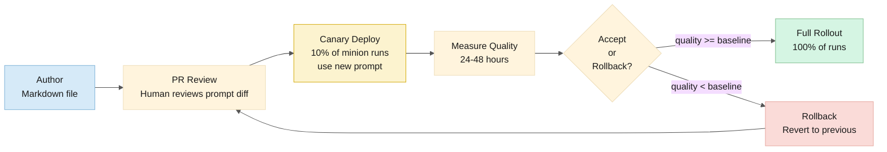

# ADR-021: Prompt lifecycle and quality measurement

| Key | Value |
|---|---|
| **Status** | Proposed |
| **Date** | 2026-06-06 |
| **Deciders** | Goose Agent Framework team |
| **Replaces** | — |
| **Superseded by** | — |

---

## Context

Minion behavior is governed by system prompts — Markdown files that define the minion's role, boundaries, output format, and reasoning approach. A prompt change can improve review quality or silently degrade it. We need a defined lifecycle for how prompts are authored, versioned, tested, deployed, measured, and rolled back.

## Decision

Prompts are **version-controlled artifacts with a measured lifecycle**. They follow the same CI/CD path as code (ADR-013), with additional quality measurement and rollback safety.

### Lifecycle Stages



### Prompt Repository Structure

```
prompts/
├── code-explorer/
│   ├── v2.1.0.md          # Current production prompt
│   ├── v2.1.1.md          # Canary candidate
│   └── CHANGELOG.md
├── code-reviewer/
│   ├── v3.2.0.md
│   └── CHANGELOG.md
├── pr-crafter/
│   ├── v1.4.0.md
│   └── CHANGELOG.md
├── ticket-analyst/
│   ├── v2.0.0.md
│   └── CHANGELOG.md
└── security-auditor/
    ├── v1.1.0.md
    └── CHANGELOG.md
```

### Canary Deployment

When a new prompt version is merged, the orchestrator runs it alongside the current version for a measurement period:

```yaml
# orchestrator extension config
prompt_canary:
  enabled: true
  minion: code-reviewer
  current: v3.2.0
  candidate: v3.2.1
  candidate_ratio: 0.10      # 10% of Code Reviewer runs use the candidate
  measurement_period_hours: 48
  rollback_trigger:
    - metric: review_acceptance_rate
      threshold: ">= 0.05 decrease"  # Rollback if acceptance drops 5%+
    - metric: avg_tokens_per_review
      threshold: ">= 0.30 increase"  # Rollback if token usage spikes 30%+
```

### Quality Metrics

| Metric | Definition | Source |
|---|---|---|
| **Review acceptance rate** | % of PR reviews where the human clicked "Approve" (vs. "Request Changes") | GitHub/ADO PR comments |
| **Review comment density** | Findings per 100 lines of diff | Code Reviewer output schema |
| **False positive rate** | Human overrides a minion finding as "not an issue" | Dashboard feedback button |
| **Token efficiency** | Tokens consumed per line of diff reviewed | Minion run metadata |
| **Time to resolution** | Wall clock time from PR open to review posted | Minion run metadata |
| **User satisfaction** | 👍/👎 reactions on review comments in Slack/Teams | Chat platform |

These are tracked in the Grafana dashboard "Minion Health" as trend lines. A canary prompt is compared against the current baseline for the same metrics.

### Rollback

Rollback is a Git revert + redeploy. Because prompts are version-controlled, rolling back means reverting to the previous version's commit:

```
1. Grafana alert: "Code Reviewer acceptance rate dropped 7%"
2. Operator checks dashboard → confirms canary prompt is the cause
3. Operator runs: git revert {canary-commit}
4. PR auto-opened → merge → CI/CD deploys
5. All Code Reviewer runs revert to v3.2.0
6. v3.2.1 is marked as "rejected" in CHANGELOG.md
```

## Rationale

- **Same pipeline as code** — Prompts are artifacts, not runtime configuration. They're tested and deployed like code.
- **Canary reduces risk** — A bad prompt degrades only 10% of runs, not 100%. The measurement period catches regressions before full rollout.
- **Metrics close the loop** — Without measurement, prompt changes are guesswork. The metrics create a feedback loop.
- **Rollback is a Git revert** — Zero operational complexity. No special prompt server or database.
- **CHANGELOG per minion** — Documents what was tried, what worked, what failed. Institutional knowledge accumulates.

## Consequences

- Prompt authors must be patient — canary deployment takes 24-48 hours before full rollout
- Metrics require a baseline period before canary experiments begin (first 2 weeks of production)
- Small teams with low PR volume (<5/day) may not have enough data for statistical significance — in that case, canary is skipped and prompts are deployed directly with operator review
- Prompt version history is public (in Git) — sensitive prompting strategies may need a private prompt repo
