# ADR-022: Multi-tenancy model

| Key | Value |
|---|---|
| **Status** | Proposed |
| **Date** | 2026-06-06 |
| **Deciders** | Goose Agent Framework team |
| **Replaces** | — |
| **Superseded by** | — |

---

## Context

If multiple teams use the framework, how do we isolate their sessions, data, workspaces, and governance? Options:

1. **Shared instance, soft isolation** — one Goose deployment. Sessions tagged by team. Governance applies globally.
2. **Shared instance, hard isolation** — one Goose deployment. Each team has separate storage, workspace boundaries, and governance configs.
3. **Per-team instances** — each team gets its own full Goose deployment (Container Apps, Service Bus, Storage, etc.)

## Decision

**Shared instance with hard isolation per team.** One deployment serves all teams, but each team has logically isolated storage, workspaces, and governance. This avoids per-team infrastructure costs while maintaining security boundaries.

### Isolation Model

```mermaid
%%{init: {'theme': 'base', 'themeVariables': { 'primaryTextColor': '#1a1a1a', 'lineColor': '#555'}}}%%
graph TB
    subgraph "Shared Infrastructure"
        orch["Orchestrator\n(shared)"]
        sb["Service Bus\n(shared namespace)"]
        st["Storage Account\n(shared, per-team containers)"]
        foundry["AI Foundry\n(shared)"]
    end
    
    subgraph "Team A (auth-team)"
        ta_ws["Workspace: /repos/auth-*"]
        ta_table["Table: ToolCallLog-team-a"]
        ta_blob["Blob: minion-outputs-team-a"]
        ta_gov["Governance: team-a.yaml"]
        ta_sb_sub["SB Subscription: team-a-*"]
    end
    
    subgraph "Team B (payments-team)"
        tb_ws["Workspace: /repos/payments-*"]
        tb_table["Table: ToolCallLog-team-b"]
        tb_blob["Blob: minion-outputs-team-b"]
        tb_gov["Governance: team-b.yaml"]
        tb_sb_sub["SB Subscription: team-b-*"]
    end
    
    orch --> ta_ws
    orch --> tb_ws
    orch --> ta_table
    orch --> tb_table
    orch --> ta_blob
    orch --> tb_blob
    orch --> ta_gov
    orch --> tb_gov
    sb --> ta_sb_sub
    sb --> tb_sb_sub
    
    style orch fill:#d5f5e3,stroke:#82c091,color:#1a1a1a
    style ta_ws fill:#d6eaf8,stroke:#7fb3d8,color:#1a1a1a
    style tb_ws fill:#fcf3cf,stroke:#d4ac0d,color:#1a1a1a
```



### What's Shared

| Component | Shared? | How |
|---|---|---|
| **Orchestrator** | ✅ Shared | Single Container App deployment. Session affinity by team ID. |
| **Service Bus** | ✅ Shared | One namespace. Per-team subscriptions filter by `team_id` property on messages. |
| **AI Foundry** | ✅ Shared | One project. All teams use the same model deployments. Token usage attributed per team via custom dimension. |
| **Container Apps** | ✅ Shared | Same environment, different revision labels (not needed for isolation). |
| **Key Vault** | ✅ Shared | Secrets tagged by team. Access controlled by Managed Identity per bot. |
| **Log Analytics** | ✅ Shared | One workspace. Team ID is a log property for KQL filtering. |

### What's Isolated

| Component | Isolated? | How |
|---|---|---|
| **Workspace boundaries** | ✅ Per team | `governance.yaml` per team defines `workspace_boundaries.filesystem`. Team A can't access Team B's repos. |
| **Tool call log** | ✅ Per team | Separate Table Storage tables: `ToolCallLog-team-a`, `ToolCallLog-team-b`. Different partition prefix or separate tables. |
| **Minion outputs** | ✅ Per team | Separate Blob containers: `minion-outputs-team-a`, `minion-outputs-team-b`. |
| **Governance** | ✅ Per team | `governance-team-a.yaml`, `governance-team-b.yaml`. Different approval policies, rate limits, blocked tools. |
| **Minion allowlists** | ✅ Per team | Same minion types, but allowlists can be tuned per team. |
| **Prompts** | ⚠️ Optional | Teams can use global prompts or override with team-specific prompts. |
| **Dashboard visibility** | ✅ Per team | Sessions and tool calls filtered by team ID. Team A cannot see Team B's sessions. |

### Team Identification

Team is identified at session creation:

```
Slack/Teams message → bot adapter → extracts channel → looks up team_id from channel registry:

channel_registry.yaml:
  teams:
    "#auth-eng":
      team_id: auth-team
      workspace: /repos/auth-service
    "#payments-eng":
      team_id: payments-team
      workspace: /repos/payment-gateway
  slack:
    "C01234ABCD":
      team_id: auth-team
      workspace: /repos/auth-service
```

The `team_id` propagates through the correlation ID as a prefix: `corr_auth-team_a1b2c3`.

### Per-Team Governance

```yaml
# governance-auth-team.yaml
team: auth-team
require_approval_for:
  - github.merge_pr
  - azure_devops.complete_pr
rate_limits:
  github: 30/min              # lower limit for smaller team
workspace_boundaries:
  filesystem: ["/repos/auth-service", "/repos/auth-docs"]
  github_repos: ["org/auth-service", "org/auth-docs"]
  azure_devops_projects: ["Authentication"]

# governance-payments-team.yaml
team: payments-team
require_approval_for:
  - github.merge_pr
  - azure_devops.complete_pr
  - servicenow.close_incident  # stricter for PCI zone
rate_limits:
  github: 50/min
workspace_boundaries:
  filesystem: ["/repos/payment-gateway", "/repos/billing"]
  github_repos: ["org/payment-gateway"]
  compliance: pci-dss           # flagged for audit
```

## Rationale

- **Cost efficiency** — One AI Foundry project, one Service Bus namespace, one Log Analytics workspace. Per-team instances would multiply these costs.
- **Security** — Hard isolation where it matters: workspaces, tool call logs, minion outputs. Team A cannot see Team B's data.
- **Operational simplicity** — One deployment to monitor, one set of alerts, one CI/CD pipeline.
- **Team autonomy** — Teams control their own governance (approval policies, rate limits, blocked tools) within the shared infrastructure.
- **Natural growth path** — Start with one team (no tenancy overhead). Add teams by adding config files, not infrastructure.

## Consequences

- Channel-to-team mapping must be maintained (PR-reviewed, version-controlled)
- Table Storage tables must be created per team (automated in Bicep per team definition)
- Dashboard must enforce team-level filtering (team_id is a property on every session)
- Shared AI Foundry means LLM throttling affects all teams — PTU allocation must be planned across teams
- Per-team prompt overrides add complexity — prefer global prompts initially
