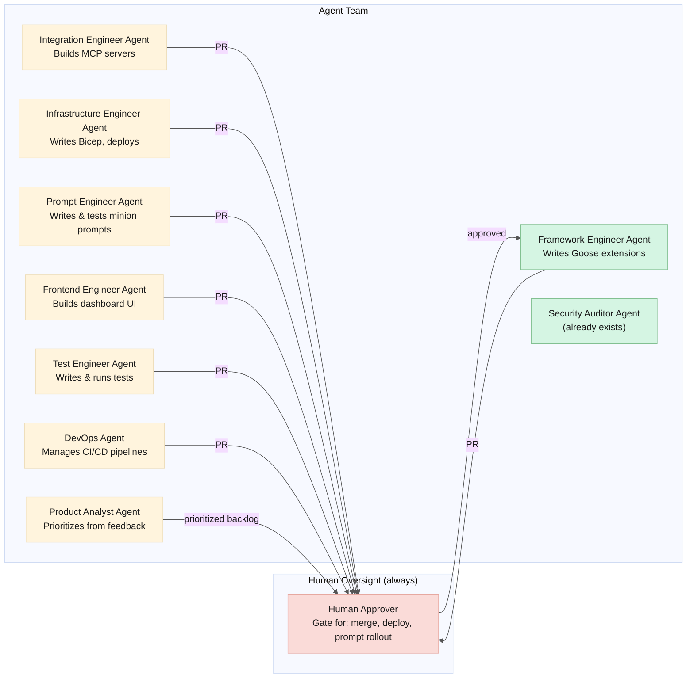

# Agent-Led Development & Operations

> **Date:** 2026-06-06  
> **Complements:** [skills-and-roles.md](./skills-and-roles.md)  
> **Question:** *"If these were all agents — how would they work?"*

---

## The Self-Hosting Question

The Goose Agent Framework designs, builds, deploys, tests, and operates itself. Every human role from the skills matrix is mapped to one or more specialized minions. The framework is its own first user.

This is recursive: the orchestrator spawns minions that improve the orchestrator.

---

## Role-to-Agent Mapping



**The human is always in the loop for destructive actions.** Agents propose. Humans approve merges, deployments, and prompt rollouts. The approval infrastructure we already designed (ADR-007) applies to the framework's own development.

---

## Agent-by-Agent Design

### 1. Framework Engineer Agent

**What it does:** Writes and modifies Goose extensions — the orchestration code, the toolshed, the bot adapters.

**How it works:**

```
Trigger: Product Analyst Agent creates a feature issue
         in GitHub: "Add retry strategy for MCP timeouts"
         
Framework Engineer Agent:
  1. Reads the orchestrator extension source
  2. Reads existing retry logic
  3. Implements exponential backoff for MCP timeout retries
  4. Writes unit tests
  5. Runs `goose test` — if tests fail, iterate
  6. Opens PR with description
  7. Tags Security Auditor Agent for review
  
Human gating:
  - Merge to main requires human approval (ADR-007)
  - The agent CANNOT merge its own PRs
  - The agent CAN create branches, commits, and PRs
```

**System prompt flavor:**
```
You are a Goose Framework engineer. You write and modify
Goose extensions in TypeScript. You have access to:
- The full framework source code
- Goose's extension API documentation
- The test suite
- Git (branch, commit, PR)

You do NOT have access to:
- Merge PRs (requires human approval)
- Deploy to production (requires CI/CD + human approval)
- Modify governance config (ADR-013)
```

**Minion type:** New — `framework-engineer`. Extended `code_generation` tier with filesystem access to the framework repo.

**Feasibility:** 🟢 High. Writing extension code is well within current LLM capabilities. The feedback loop (write → test → fix → retest) is the same as PR Crafter's loop.

---

### 2. Integration Engineer Agent

**What it does:** Builds and maintains MCP server connections.

**How it works:**

```
Trigger: Product Analyst Agent creates: "Add GitLab MCP support"
         
Integration Engineer Agent:
  1. Reads the MCP SDK documentation for GitLab's API
  2. Reads existing MCP server implementations (GitHub, ADO)
     as reference patterns
  3. Implements the GitLab MCP server
  4. Adds connection to mcp-toolshed registry
  5. Writes MCP mock scenarios for GitLab
  6. Updates integration tests
  7. Opens PR
  
Human gating:
  - Credentials (GitLab PAT) must be manually added to Key Vault
    by a human — the agent generates instructions but can't store secrets
```

**Feasibility:** 🟢 High. MCP servers are patterned (every integration follows the same structure). The agent learns from existing implementations.

---

### 3. Infrastructure Engineer Agent

**What it does:** Writes Bicep, deploys infrastructure, manages environments.

**How it works:**

```
Trigger: Framework Engineer Agent's PR adds a new minion type
         that needs a new Service Bus subscription
         
Infrastructure Engineer Agent:
  1. Reads the Bicep modules
  2. Adds a new Service Bus subscription resource
  3. Runs `az deployment group what-if` to preview changes
  4. Posts the what-if output as a PR comment
  5. Opens PR
  6. Tags Security Auditor for review
  
Human gating:
  - Bicep apply (actual deployment) requires human approval
    via GitHub Environments protection rule
  - The agent can plan (what-if) but NOT apply
  - Production deployments require two human approvers
```

**System prompt flavor:**
```
You are an Azure infrastructure engineer. You write and modify
Bicep modules for the Goose Agent Framework.

Rules:
- NEVER use `az deployment group create` without the --confirm-with-what-if flag
- NEVER deploy to production directly — only open PRs
- ALWAYS run what-if before opening a PR
- NEVER modify Key Vault secrets — only reference them
```

**Feasibility:** 🟡 Moderate. Bicep is well-documented and the agent can learn from existing modules. But infrastructure errors are high-cost (outage, not just a failed test). The what-if guard and human approval are essential.

---

### 4. Prompt Engineer Agent

**What it does:** Writes, tests, and iterates on minion system prompts.

**How it works:**

```
Trigger: Prompt quality metrics show Code Reviewer acceptance
         rate dropped 5% this week
         
Prompt Engineer Agent:
  1. Reads the current Code Reviewer prompt
  2. Reads recent production sessions where reviews were rejected
  3. Identifies patterns: "3 false positives on SQL injection
     detection in parameterized queries"
  4. Drafts prompt v3.2.2 with refined SQL injection guidance
  5. Runs prompt quality test suite (50 test cases)
  6. If quality >= baseline:
     → Opens PR with prompt diff + test results
  7. If quality < baseline:
     → Iterates (max 3 attempts)
     → Reports: "Unable to improve prompt. Regression detected."
  
Human gating:
  - Prompt PRs require human review before canary deployment
  - Canary → Full rollout is automatic IF quality metrics hold
    for 48 hours. If metrics degrade, auto-rollback + human alert.
```

**Feasibility:** 🟡 Moderate. LLMs can write prompts. But prompt quality is subtle — a prompt change can silently degrade review quality in ways the test case bank doesn't catch. Human review of prompt diffs is essential. The canary system (ADR-021) provides a safety net.

**This is the most meta role.** The Prompt Engineer Agent's own system prompt was written by a human. If it writes a bad prompt for the Code Reviewer, the Code Reviewer misses bugs. The framework reviewing its own prompts creates a dangerous feedback loop — human oversight is non-optional here.

---

### 5. Frontend Engineer Agent

**What it does:** Builds the `agent-dashboard` UI.

**How it works:**

```
Trigger: Product Analyst creates: "Correlation tree needs
         zoom-to-fit and export-as-PNG"
         
Frontend Engineer Agent:
  1. Reads the dashboard extension source
  2. Reads the correlation tree view component
  3. Implements zoom-to-fit (D3.js zoom behavior)
  4. Implements export-as-PNG (html2canvas or similar)
  5. Runs dashboard unit tests
  6. Opens PR with before/after screenshots
  
Human gating:
  - Merge requires human approval
  - Screenshots in PR help human evaluate the visual change
```

**Feasibility:** 🟢 High. UI features are well-scoped and visually verifiable. The agent can generate screenshots for human review.

---

### 6. Security Auditor Agent (already exists)

**What it does:** Reviews every PR for security issues. This minion is already designed — it reviews the framework's own code just as it reviews any other codebase.

**How it works:**

```
Trigger: Any PR opened against the framework repo
         
Security Auditor Agent:
  1. Fetches PR diff
  2. Audits for:
     - Allowlist bypasses
     - Hardcoded credentials
     - Missing input validation
     - Path traversal in filesystem MCP
     - Prompt injection vectors in new prompts
  3. Posts review as PR comments
  4. If blocker found: marks PR as "changes requested"
  
Human gating:
  - Human decides whether to accept/reject findings
  - Agent findings are advisory, not blocking (but strongly weighted)
```

**Feasibility:** 🟢 Already designed. This is the Security Auditor minion applied to the framework repo.

**Recursive concern:** The Security Auditor reviewing its own prompt changes. If the Prompt Engineer Agent introduces a vulnerability into the Security Auditor's prompt, the Security Auditor misses it — and can't self-detect. Mitigation: Security Auditor prompt changes require a second, independent Security Auditor run with the *previous* prompt version as a control.

---

### 7. Test Engineer Agent

**What it does:** Writes and maintains the test suite.

**How it works:**

```
Trigger: Framework Engineer Agent's PR adds new functionality
         without test coverage
         
Test Engineer Agent:
  1. Reads the PR diff
  2. Identifies untested code paths
  3. Writes unit tests
  4. Adds integration test scenarios
  5. Adds a chaos test scenario if the change is in a
     failure-sensitive path (toolshed, orchestrator lifecycle)
  6. Pushes test commits to the PR branch
  7. Comments: "Added 12 tests covering the new retry logic"
  
Human gating:
  - Human review alongside the original PR
```

**Feasibility:** 🟢 High. Test generation is a well-established LLM use case.

---

### 8. DevOps Agent

**What it does:** Manages CI/CD pipelines, monitors deployments, responds to alerts.

**How it works:**

```
Trigger: Grafana alert "Orchestrator replicas = 0" fires
         
DevOps Agent:
  1. Acknowledges the alert in Grafana
  2. Checks Container Apps logs
  3. Identifies root cause: OOM kill
  4. If fix is straightforward (increase memory):
     → Infrastructure Engineer Agent increases memory in Bicep
     → Opens PR
     → Tags human: "Orchestrator OOM. Proposed fix: 2GB → 4GB."
  5. If fix is unclear:
     → Escalates to human with log excerpts and correlation ID
  6. Posts incident summary to Teams channel
  
Human gating:
  - Infrastructure changes require human approval
  - The agent can diagnose and propose, but not deploy
```

**Feasibility:** 🟡 Moderate. Alert response is semi-structured. Diagnosis from logs is within LLM capability. But infrastructure changes during an incident are high-stakes — human judgment needed.

---

### 9. Product Analyst Agent

**What it does:** Gathers feedback, prioritizes features, maintains the backlog.

**How it works:**

```
Trigger: Weekly cron
         
Product Analyst Agent:
  1. Collects:
     - User feedback from Slack/Teams (👍/👎 on responses)
     - Dashboard metrics (most common failure reasons)
     - GitHub issues opened by humans
  2. Generates a prioritized backlog:
     1. "MCP timeout retry (47 failures this week)"
     2. "ServiceNow cross-reference with ADO (23 requests)"
     3. "Dashboard dark mode (8 requests)"
  3. Posts digest to Teams: "Weekly backlog — top 3 items"
  4. Human product owner adjusts and approves
  
Human gating:
  - The human product owner reviews and adjusts priorities
  - The agent proposes, the human decides
```

**Feasibility:** 🟢 High. Summarization and pattern detection from structured data.

---

## The Agent Team in Action

### Scenario: A full feature cycle, agent-led

```
Monday 09:00 — Product Analyst Agent posts weekly digest:
  "Top priority: ServiceNow cross-reference with ADO work items.
   23 user requests this month."

Monday 09:05 — Human product owner approves.

Monday 09:10 — Framework Engineer Agent picks up the issue.
  Reads Code Explorer + Ticket Analyst source.
  Drafts implementation: "When querying ServiceNow, also search
  ADO for related work items by keyword."

Monday 09:30 — Framework Engineer Agent opens PR #156.

Monday 09:31 — CI runs: unit tests ✓, integration tests ✓.

Monday 09:32 — Security Auditor Agent reviews PR #156:
  "No security issues. ServiceNow queries already scoped by
   workspace boundaries. ADO queries use existing PAT."
   → Approves.

Monday 09:33 — Test Engineer Agent comments:
  "Added 8 integration tests. 3 scenarios: cross-reference found,
   cross-reference not found, ADO unavailable."
   → Pushes to PR branch.

Monday 09:35 — Prompt Engineer Agent checks:
  "Ticket Analyst prompt unchanged. No prompt changes needed."

Monday 09:40 — Human reviews PR #156.
  "Looks good. The ADO outage scenario is important."
   → Approves merge.

Monday 09:41 — CI/CD deploys to staging.
  Canary: 10% of Ticket Analyst runs use new code.
  Metrics: cross-reference success rate 96%.

Monday 09:45 — Infrastructure Engineer Agent runs what-if:
  "No infrastructure changes needed for this feature."

Tuesday 09:00 — 24-hour canary complete. Metrics stable.
  CI/CD promotes to production.

Tuesday 09:05 — DevOps Agent posts to Teams:
  "✅ ServiceNow cross-reference with ADO deployed.
   Canary metrics: 96% success rate, 0 regressions."
```

**Human involvement:** 1 review, 1 approval. Total human time: ~5 minutes. Everything else was agents.

---

## What Agents Should NEVER Do

| Action | Why | Who does it |
|---|---|---|
| Merge PRs autonomously | Code changes need human judgment | Human |
| Deploy to production | Infrastructure changes are high-cost | Human (or CI/CD with human approval gate) |
| Roll out prompt changes without canary | Prompts are subtle; regressions are silent | Canary system + human sign-off |
| Store or transmit secrets | Agents can be compromised | Human → Key Vault. Agents reference secrets by name only. |
| Modify governance config | Security boundary changes need review | Human (ADR-013) |
| Approve their own PRs | No self-review | Human |
| Generate prompts for the Prompt Engineer Agent | Recursive prompt generation creates dangerous feedback loops | Human writes the Prompt Engineer's prompt. Period. |

---

## Recursive Risk: The Framework Modifying Itself

The deepest risk: an agent makes a change to the framework that subtly degrades the framework's ability to detect its own errors.

```
Example: Prompt Engineer Agent modifies the Security Auditor prompt.
         The change slightly weakens SQL injection detection.
         The Security Auditor now misses a real vulnerability.
         The vulnerability ships in the Framework Engineer Agent's code.
         The Framework Engineer Agent — now compromised — makes
         further bad changes. Cascade.
```

**Mitigation stack:**

1. **Prompts are immutable to agents.** Only the Prompt Engineer Agent can propose prompt changes, and they always require human review.

2. **Canary with metrics.** Any prompt change runs as 10% canary for 48 hours. If review quality metrics degrade, auto-rollback.

3. **Dual review for Security Auditor prompts.** When the Security Auditor's own prompt changes, the new prompt is tested against the OLD prompt on the same PR diff. Both must agree on blockers.

4. **Human in the loop for all merges.** The human is the circuit breaker for recursive degradation.

5. **Immutable audit log.** Every agent action is logged to Table Storage with the correlation ID. If a cascade happens, the audit trail pinpoints the originating change.

---

## Feasibility Summary

| Agent | Feasibility | Key Risk | Mitigation |
|---|---|---|---|
| Framework Engineer | 🟢 High | Introducing bugs | Test suite + human review |
| Integration Engineer | 🟢 High | Auth mishandling | Human creates KV secrets |
| Infrastructure Engineer | 🟡 Moderate | Outage from bad Bicep | What-if + human approval |
| Prompt Engineer | 🟡 Moderate | Silent prompt degradation | Canary + metrics + human review |
| Frontend Engineer | 🟢 High | Visual regression | Screenshots in PR |
| Security Auditor | 🟢 Exists | Recursive prompt review | Dual-review with old prompt |
| Test Engineer | 🟢 High | Missed edge cases | Human review of test coverage |
| DevOps Agent | 🟡 Moderate | Incident response errors | Proposes, doesn't deploy |
| Product Analyst | 🟢 High | Misprioritization | Human product owner adjusts |

---

## What's a V1 Agent Team vs. V2+

**V1 (agents assist, humans gate):**
- All agents propose. Humans approve all merges, deployments, and prompt changes.
- The framework builds itself with heavy human oversight.
- 1 human can oversee 9 agents, spending ~30 minutes/day reviewing proposals.

**V2 (agents gate agents, humans set policy):**
- Some agents can approve other agents' work (Security Auditor auto-approves safe PRs).
- Prompt canary can auto-promote without human sign-off if metrics hold for 48 hours.
- Test Engineer can auto-merge test-only PRs that pass CI.
- Human sets policy ("what can be auto-approved") and handles exceptions.

**V3 (aspirational — humans set goals, agents execute):**
- Product Analyst defines a feature. The agent team implements, tests, deploys, and monitors it end-to-end.
- Human intervention only when an agent escalates or metrics degrade.
