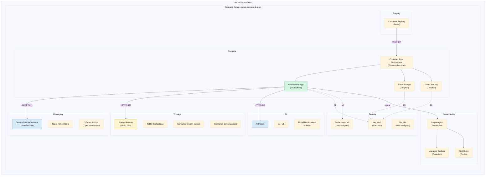
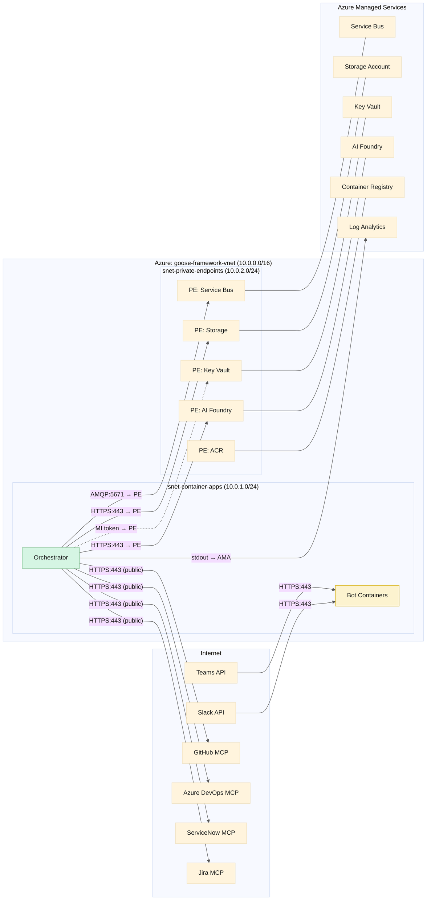
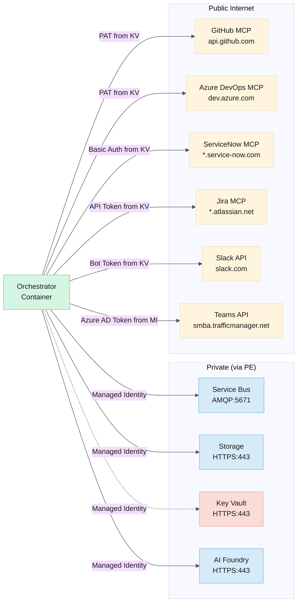
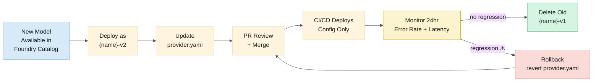
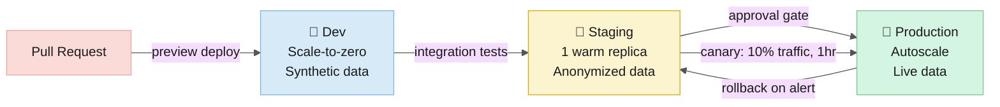
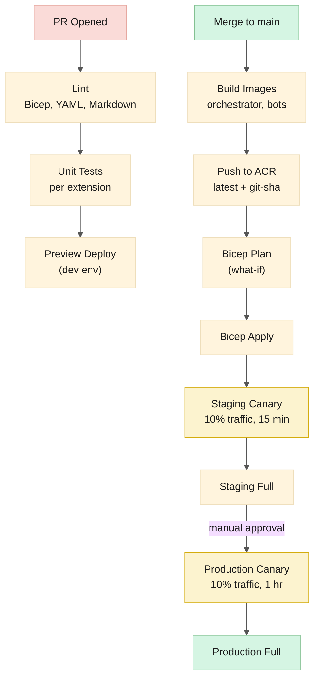
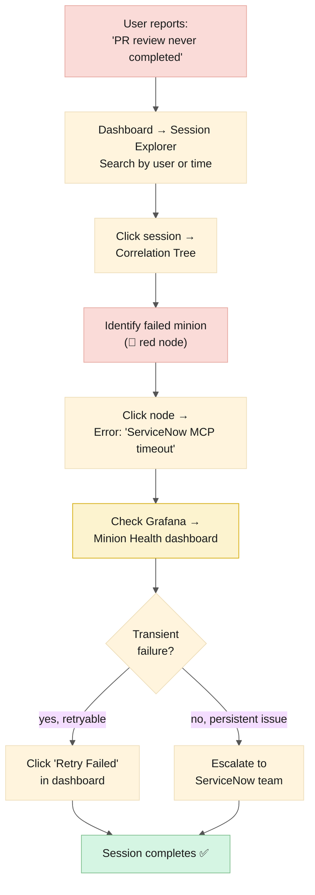
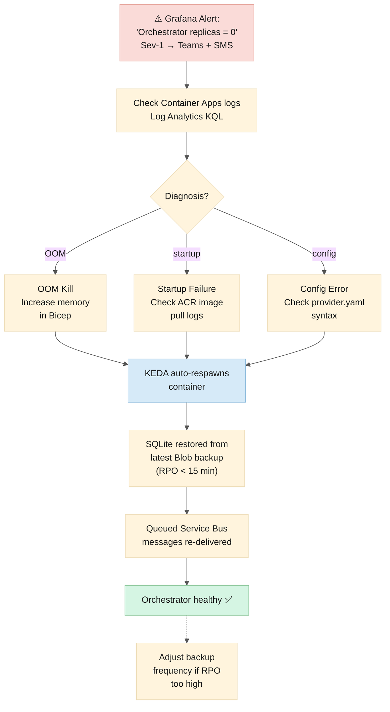
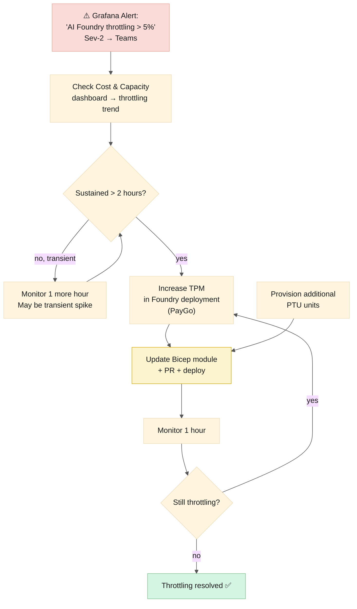

# Azure Architecture Design

> **Date:** 2026-06-06  
> **Status:** Draft  
> **Complements:** [physical-architecture.md](./physical-architecture.md), [logical-architecture.md](./logical-architecture.md)

---

## Table of Contents

1. [Architecture Diagrams](#architecture-diagrams)
2. [Resource Inventory](#resource-inventory)
3. [Resource Sizing Rationale](#resource-sizing-rationale)
4. [Networking Deep Dive](#networking-deep-dive)
5. [Identity Deep Dive](#identity-deep-dive)
6. [AI Foundry Deployment Strategy](#ai-foundry-deployment-strategy)
7. [Security Baseline](#security-baseline)
8. [Environments](#environments)
9. [CI/CD Pipeline](#cicd-pipeline)
10. [Operational Runbooks](#operational-runbooks)

---

## Architecture Diagrams

### Azure Resource Map



### Network Topology (Azure View)



---

## Resource Inventory

### Naming Convention

```
Pattern: {type}-{app}-{env}-{region}

Examples:
  ca-goosefw-prod-uksouth        Container Apps Environment
  sb-goosefw-prod                Service Bus Namespace
  stgoosefwprod                  Storage Account (alphanumeric only)
  kv-goosefw-prod                Key Vault
  foundry-goosefw-prod           AI Foundry Hub
  acrgoosefw                     Container Registry (unique, alphanumeric)
```

### Full Inventory

| Resource | Name | SKU | Purpose |
|---|---|---|---|
| **Resource Group** | `rg-goosefw-{env}` | — | Logical container |
| **VNet** | `vnet-goosefw-{env}` | — | 10.0.0.0/16 |
| **Subnet: container-apps** | `snet-ca-goosefw-{env}` | — | 10.0.1.0/24, delegated to Microsoft.App |
| **Subnet: private-endpoints** | `snet-pe-goosefw-{env}` | — | 10.0.2.0/24 |
| **NSG: container-apps** | `nsg-ca-goosefw-{env}` | — | Inbound: 443 from Internet; Outbound: 443, 5671 |
| **NSG: private-endpoints** | `nsg-pe-goosefw-{env}` | — | Inbound: 443, 5671 from container-apps |
| **Container Apps Environment** | `cae-goosefw-{env}` | Consumption | Workload profiles: Consumption |
| **Container App: Orchestrator** | `ca-orchestrator-{env}` | — | 1 vCPU, 2 GB, 1–5 replicas |
| **Container App: Slack Bot** | `ca-slackbot-{env}` | — | 0.5 vCPU, 1 GB, 1 replica |
| **Container App: Teams Bot** | `ca-teamsbot-{env}` | — | 0.5 vCPU, 1 GB, 1 replica |
| **Service Bus Namespace** | `sb-goosefw-{env}` | Standard | Sessions, DLQ, duplicate detection |
| **Service Bus Topic** | `minion-tasks` | — | All minion tasks |
| **Service Bus Subscriptions** | `code-explorer`, `code-reviewer`, `pr-crafter`, `ticket-analyst`, `security-auditor` | — | Filtered by minion_type property |
| **Storage Account** | `stgoosefw{env}` | LRS / ZRS | Tables + Blobs |
| **Table** | `ToolCallLog` | — | Immutable tool call log |
| **Blob Container** | `minion-outputs` | Cool | Full minion output artifacts |
| **Blob Container** | `sqlite-backups` | Cool | Orchestrator SQLite WAL snapshots |
| **Key Vault** | `kv-goosefw-{env}` | Standard | MCP credentials, bot secrets |
| **AI Foundry Hub** | `foundry-goosefw-{env}` | — | Model catalog, content safety |
| **AI Foundry Project** | `foundry-goosefw-project` | — | Deployments, endpoints |
| **AI Foundry Deployments** | `fast`, `reasoning`, `code-review`, `code-gen`, `security` | Various | 5 model tiers |
| **Log Analytics Workspace** | `la-goosefw-{env}` | Pay-as-you-go | 31-day retention default |
| **Managed Grafana** | `graf-goosefw-{env}` | Essential | 2 dashboards, 5 users |
| **Container Registry** | `acrgoosefw` | Basic | Container images |
| **Managed Identity: Orchestrator** | `mi-orch-goosefw-{env}` | User-assigned | Azure service auth |
| **Managed Identity: Slack Bot** | `mi-slack-goosefw-{env}` | User-assigned | KV access |
| **Managed Identity: Teams Bot** | `mi-teams-goosefw-{env}` | User-assigned | KV access |

---

## Resource Sizing Rationale

### Why Consumption Plan (not Dedicated)

| Factor | Consumption | Dedicated |
|---|---|---|
| Minimum monthly cost | $0 (scale-to-zero) | ~$150 (1 worker, always on) |
| Cold start | 5–15 seconds | None |
| vCPU max | 4.0 | 32.0 |
| Session isolation | Per-request | Shared worker |
| Stateful workloads | Not supported | Supported |

**Our workload is event-driven and bursty.** Sessions arrive via Slack/Teams messages — sporadic, mostly during business hours. There is no steady stream of requests. Consumption plan's scale-to-zero saves $100+/month vs. Dedicated. Cold start latency is acceptable because:
- Bots are always warm (1 replica minimum)
- The orchestrator's first classification takes <1 second of LLM time; the 5–15s cold start is hidden behind the bot's "working..." acknowledgment

### Why Service Bus Standard (not Premium)

| Feature | Standard | Premium |
|---|---|---|
| Sessions | ✅ | ✅ |
| Dead-letter | ✅ | ✅ |
| Duplicate detection | ✅ | ✅ |
| Message size | 256 KB | 100 MB |
| Cost | $10/month | ~$700/month |
| Availability zones | Paired region | Within region |

Standard tier provides all messaging features the framework needs. Large context payloads (>256 KB) go via Blob Storage with a SAS URL in the Service Bus message — the Premium tier's 100 MB message size is unnecessary.

### Why LRS (not ZRS for dev)

| Environment | Storage Redundancy | Rationale |
|---|---|---|
| Dev | LRS | Cost optimization. Data loss is acceptable. |
| Staging | LRS | Cost optimization. |
| Production | ZRS | Zone redundancy. Survives a single zone failure. |

### Why AI Foundry PTU is Optional

Provisioned Throughput (PTU) guarantees capacity and predictable cost. Pay-as-you-go (PayGo) is cheaper at low volume but may throttle under load.

| Scenario | Recommendation |
|---|---|
| Dev/Staging | PayGo — minimal cost |
| Production, <200 sessions/day | PayGo — cheaper than PTU minimum |
| Production, >200 sessions/day | PTU for `reasoning` and `code_review` tiers |
| Production, spiky | PayGo + alert if throttling detected |

---

## Networking Deep Dive

### Private Endpoint DNS

Each private endpoint creates a private DNS zone for its service. Container Apps resolves these to private IPs within the VNet.

```
Private DNS Zones (auto-created):

privatelink.servicebus.windows.net
  └── sb-goosefw-prod → 10.0.2.4

privatelink.table.core.windows.net
  └── stgoosefwprod → 10.0.2.5

privatelink.blob.core.windows.net
  └── stgoosefwprod → 10.0.2.6

privatelink.vaultcore.azure.net
  └── kv-goosefw-prod → 10.0.2.7

privatelink.openai.azure.com
  └── foundry-goosefw-prod → 10.0.2.8

privatelink.azurecr.io
  └── acrgoosefw → 10.0.2.9
```

### Egress Paths



**Two egress paths, two auth models.** Azure services (left) use Managed Identity over private endpoints — no credentials in code. External MCP servers (right) use PATs or API tokens fetched from Key Vault at startup. Teams is the exception — it uses Azure AD token via managed identity, sharing auth with the Azure services.

| Destination | Path | Authentication |
|---|---|---|
| GitHub MCP (api.github.com) | Internet (public) | PAT from Key Vault |
| Azure DevOps MCP (dev.azure.com) | Internet (public) | PAT from Key Vault |
| ServiceNow MCP | Internet (public) | Basic auth from Key Vault |
| Jira MCP | Internet (public) | API token from Key Vault |
| Slack API | Internet (public) | Bot token from Key Vault |
| Teams API | Internet (public) | Azure AD token via MI |
| AI Foundry | Private endpoint | Managed Identity |
| Service Bus | Private endpoint | Managed Identity |
| Storage Account | Private endpoint | Managed Identity |
| Key Vault | Private endpoint | Managed Identity |

### Ingress Paths

| Source | Target | Authentication |
|---|---|---|
| Slack (slack.com) | ca-slackbot-*.azurecontainerapps.io | Slack signing secret |
| Teams (botframework.com) | ca-teamsbot-*.azurecontainerapps.io | Bot Framework auth |
| GitHub Actions (CI/CD) | Azure Resource Manager (public) | OIDC federation |
| Operator (dashboard) | ca-dashboard-*.azurecontainerapps.io | Azure AD (future) |

---

## Identity Deep Dive

### Managed Identity Hierarchy

```
User-Assigned Managed Identities
├── mi-orch-goosefw-{env}
│   ├── Role: Storage Table Data Contributor → stgoosefw{env}
│   ├── Role: Storage Blob Data Contributor → stgoosefw{env}
│   ├── Role: Azure Service Bus Data Sender → sb-goosefw-{env}
│   ├── Role: Azure Service Bus Data Receiver → sb-goosefw-{env}
│   ├── Role: Cognitive Services OpenAI User → foundry-goosefw-{env}
│   └── Role: Key Vault Secrets User → kv-goosefw-{env}
│
├── mi-slack-goosefw-{env}
│   └── Role: Key Vault Secrets User → kv-goosefw-{env}
│       (scope: secret/slack-signing-secret, secret/slack-bot-token)
│
└── mi-teams-goosefw-{env}
    └── Role: Key Vault Secrets User → kv-goosefw-{env}
        (scope: secret/teams-bot-password)
```

### Least Privilege Principle

| Identity | What it can access | What it CANNOT access |
|---|---|---|
| Orchestrator MI | SB: send/receive. Storage: read/write tables+blobs. Foundry: call models. KV: read secrets. | Delete resources. Modify RBAC. Access other Key Vaults. |
| Slack Bot MI | KV: read Slack secrets only | Everything else |
| Teams Bot MI | KV: read Teams secrets only | Everything else |
| GitHub OIDC | ACR: push/pull. Container Apps: update revisions. | Read secrets from KV. Access production data. |

### Key Vault RBAC (not Access Policies)

Key Vault uses **RBAC authorization** (not legacy Access Policies) for consistent Azure RBAC across all resources.

```yaml
# Bicep example
resource kvRoleAssignment 'Microsoft.Authorization/roleAssignments@2022-04-01' = {
  name: guid(kv.id, miOrch.id, 'Key Vault Secrets User')
  properties: {
    principalId: miOrch.properties.principalId
    roleDefinitionId: resourceId('Microsoft.Authorization/roleDefinitions', '4633458b-17de-408a-b874-0445c86b69e6') // Key Vault Secrets User
    principalType: 'ServicePrincipal'
  }
}
```

---

## AI Foundry Deployment Strategy

### Hub and Project Model

```
AI Foundry Hub: foundry-goosefw-{env}
├── Content Safety: enabled (prompt injection, hate speech, violence, self-harm)
├── Network Isolation: private endpoint
│
└── AI Project: goosefw-orchestration
    ├── Deployment: fast (GPT-4o-mini → replaceable)
    │   ├── SKU: GlobalStandard (PayGo)
    │   ├── Capacity: 50K TPM
    │   └── Content Filter: DefaultV2
    │
    ├── Deployment: reasoning (GPT-4.1 → replaceable)
    │   ├── SKU: GlobalStandard (PayGo, optional PTU)
    │   ├── Capacity: 200K TPM
    │   └── Content Filter: DefaultV2
    │
    ├── Deployment: code-review (Claude Sonnet 4.8 → replaceable)
    │   ├── SKU: GlobalStandard (PayGo)
    │   ├── Capacity: 100K TPM
    │   └── Content Filter: DefaultV2
    │
    ├── Deployment: code-gen (GPT-4.1 → replaceable)
    │   ├── SKU: GlobalStandard (PayGo)
    │   ├── Capacity: 100K TPM
    │   └── Content Filter: DefaultV2
    │
    └── Deployment: security (Claude Sonnet 4.8 → replaceable)
        ├── SKU: GlobalStandard (PayGo)
        ├── Capacity: 50K TPM
        └── Content Filter: DefaultV2
```

### Content Safety Configuration

| Filter | Severity Threshold | Action |
|---|---|---|
| Prompt injection (jailbreak) | Low | Block request, log event |
| Hate speech | Medium | Block request |
| Violence | Medium | Block request |
| Self-harm | Low | Block request |
| Sexual content | Medium | Block request |

Content safety is enabled at the AI Foundry level — no code in Goose handles content filtering.

### Model Upgrade Process



1. New model version available in AI Foundry catalog
2. Deploy new model to a new deployment (e.g., `fast-v2`)
3. Update `provider.yaml` → point `fast` tier to `fast-v2`
4. Deploy config change via CI/CD (no container rebuild needed if config is mounted)
5. Monitor error rate and latency for 24 hours
6. Delete old deployment (`fast-v1`)

---

## Security Baseline

### Azure Policy Assignments

| Policy | Scope | Effect |
|---|---|---|
| Key Vault secrets should have expiration dates | `rg-goosefw-*` | Audit (90-day expiry recommended) |
| Storage accounts should use private endpoints | `rg-goosefw-*` | Deny public access |
| Container Apps should use private endpoints | `rg-goosefw-*` | Audit (Managed TLS is public) |
| Service Bus should use private endpoints | `rg-goosefw-*` | Deny public access |
| AI Foundry should disable public network access | `rg-goosefw-*` | Deny public access |
| Subnets should have NSGs | All subnets | Deny |
| Managed Identities should be used | `rg-goosefw-*` | Audit |

### Defender for Cloud

Enable Defender for Cloud (free tier) on the subscription. Recommendations:
- Enable encryption-at-rest for all storage accounts ✅ (default)
- Enable soft delete for Key Vault ✅ (default, 90 days)
- Enable soft delete for Blob Storage ✅ (7 days minimum)
- Enable versioning for Blob Storage ✅

### Secret Rotation

| Secret | Rotation Cadence | Automation |
|---|---|---|
| GitHub PAT | 90 days | Manual (GitHub App token preferred — auto-rotating) |
| Azure DevOps PAT | 90 days | Manual |
| ServiceNow password | Per org policy | Manual |
| Jira API token | Per org policy | Manual |
| Slack signing secret | Never (Slack-managed) | — |
| Teams bot password | Per org policy | Manual |

---

## Environments

### Environment Strategy



| Environment | Purpose | Scaling | Data |
|---|---|---|---|
| **dev** | Active development, PR testing | Scale-to-zero when idle | Synthetic test data only |
| **staging** | Pre-production validation | 1 warm replica during test hours | Anonymized production data (optional) |
| **prod** | Production | Scale with demand | Live data |

### Per-Environment Configuration

| Setting | dev | staging | prod |
|---|---|---|---|
| Container Apps plan | Consumption | Consumption | Consumption |
| Service Bus tier | Standard | Standard | Standard |
| Storage redundancy | LRS | LRS | ZRS |
| AI Foundry SKU | PayGo | PayGo | PayGo (PTU optional) |
| Log Analytics retention | 30 days | 30 days | 90 days |
| Key Vault soft delete | 7 days | 7 days | 90 days |
| Grafana | Essential | Essential | Standard ($9/user if >5 users) |
| Private endpoints | 3 (SB, Storage, KV) | 5 (+ACR, Foundry) | 6 (all) |
| Scale-to-zero outside hours | Yes | Yes | No (1 replica minimum) |

---

## CI/CD Pipeline

### Pipeline Architecture



```
GitHub Repo: org/goose-agent-framework
│
├── PR opened
│   ├── Lint (Bicep, YAML, Markdown)
│   ├── Unit tests (per extension)
│   └── Preview deployment (dev environment)
│
├── Merge to main
│   ├── Build container images
│   │   ├── orchestrator
│   │   ├── slack-bot
│   │   └── teams-bot
│   ├── Push to ACR
│   │   ├── Tag: latest
│   │   └── Tag: git-sha
│   ├── Deploy infrastructure (Bicep)
│   │   ├── Plan (what-if)
│   │   └── Apply
│   └── Deploy containers
│       ├── Staging: canary (10% traffic, 15 min)
│       ├── Staging: full rollout
│       ├── Prod: canary (10% traffic, 1 hour)
│       └── Prod: full rollout
│
└── Scheduled (weekly)
    ├── Security scan (container images)
    ├── Dependency update (automated PR)
    └── Cost report to Teams
```

### GitHub Actions Workflows

```
.github/workflows/
├── ci.yml              # PR: lint, test, preview deploy
├── build.yml           # Build + push container images
├── deploy-dev.yml      # Deploy to dev (on push to feature/*)
├── deploy-staging.yml  # Deploy to staging (on merge to main)
├── deploy-prod.yml     # Deploy to prod (manual approval after staging)
├── destroy-dev.yml     # Tear down dev on PR close
├── security-scan.yml   # Weekly container + dependency scan
└── cost-report.yml     # Weekly cost summary to Teams
```

---

## Operational Runbooks

### Runbook 1: Deploy a Model Tier Update

1. Confirm new model is available in AI Foundry catalog
2. Create new deployment in AI Foundry (e.g., `reasoning-v2`)
3. Update `provider.yaml`: change `reasoning` tier deployment to `reasoning-v2`
4. PR → review → merge
5. CI/CD deploys config change (no container rebuild)
6. Monitor Grafana dashboard "Cost & Capacity" for 24 hours
7. If error rate < baseline, delete old deployment

### Runbook 2: Investigate a Failed Session



1. User reports: "My PR review never completed"
2. Open dashboard → Session Explorer
3. Search by user or approximate time
4. Click session → Correlation Tree
5. Identify failed minion (red node)
6. Click failed minion → see error: "ServiceNow MCP timeout"
7. Check Grafana → Minion Health → ServiceNow latency spike
8. If transient: click "Retry Failed" in dashboard
9. If persistent: escalate to ServiceNow team; check MCP server health

### Runbook 3: Recover from Orchestrator Crash



1. Grafana alert: "Orchestrator replicas = 0" (Sev-1)
2. Check Container Apps logs in Log Analytics
3. If OOM: check SQLite size; increase memory allocation in Bicep
4. If startup failure: check container image pull logs in ACR
5. KEDA automatically respawns the container
6. SQLite restored from latest Blob backup (<15 min RPO)
7. Queued Service Bus messages re-delivered to new replica
8. Review: adjust SQLite backup frequency if RPO is too high

### Runbook 4: Scale AI Foundry Capacity



1. Grafana alert: "AI Foundry throttling rate > 5%" (Sev-2)
2. Check "Cost & Capacity" dashboard → throttling trend
3. If sustained >2 hours: increase TPM for affected tier
   - PayGo: increase capacity in AI Foundry deployment settings
   - PTU: provision additional PTU units
4. Update Bicep module → PR → deploy
5. Monitor for 1 hour; if throttling persists, repeat
