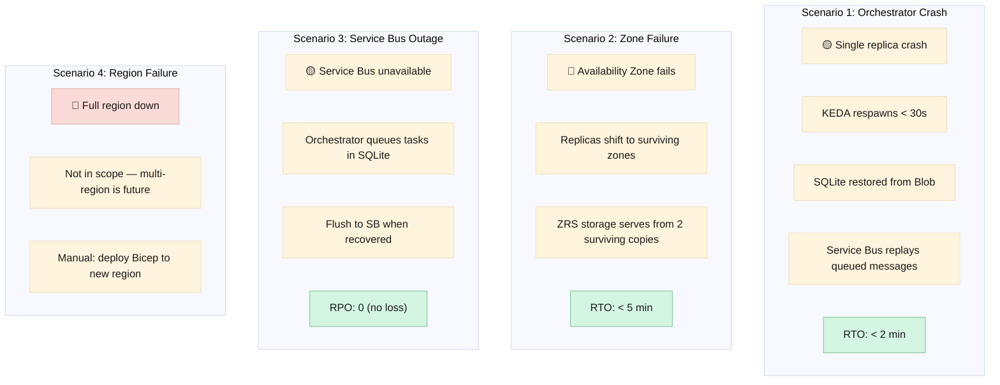

# Disaster Recovery

> **Date:** 2026-06-06  
> **Status:** Draft  

---

## Recovery Objectives

| Objective | Target | Measured from |
|---|---|---|
| **RTO** (Recovery Time) | < 10 minutes | Alert fires → orchestrator processes new sessions |
| **RPO** (Recovery Point) | < 15 minutes | Last SQLite WAL backup to Blob |

---

## Failure Scenarios



### Scenario 1: Orchestrator Replica Crash

| Step | Action | Time |
|---|---|---|
| 1 | Container crashes (OOM, unhandled exception, etc.) | T+0 |
| 2 | KEDA detects replica count < minimum (or queue depth > 0 with 0 replicas) | T+5s |
| 3 | KEDA spawns new replica | T+10s |
| 4 | Container starts, Goose loads extensions | T+25s |
| 5 | Orchestrator checks Blob for latest SQLite backup | T+26s |
| 6 | SQLite restored from latest WAL snapshot | T+28s |
| 7 | Orchestrator connects to Service Bus, receives queued messages | T+30s |
| 8 | In-flight sessions resume (Service Bus re-delivers unacked messages) | T+30s |
| **Total RTO** | | **< 2 minutes** |

**Data loss:** The last WAL backup may be up to 15 minutes old. Any session started in that window is lost. The user receives a "Session expired" message and can retry.

### Scenario 2: Availability Zone Failure

If an entire zone fails (power, network, cooling):

| Component | Zone 1 Fails | Impact |
|---|---|---|
| Container Apps (orchestrator) | Replicas in Zone 1 die | KEDA spawns replicas in Zones 2-3. Existing sessions replicate to new instances via Service Bus. |
| Service Bus (Standard) | Microsoft-managed paired-region redundancy | No impact — traffic routes to surviving capacity. |
| Storage (ZRS, production only) | One copy lost | Data served from 2 surviving zone copies. Microsoft replicates to a 3rd zone transparently. |
| AI Foundry | Deployment in Zone 1 unavailable | Requests route to Zone 2 deployment (if configured). Otherwise, use fallback model. |

### Scenario 3: Service Bus Outage

| Step | Action |
|---|---|
| 1 | Orchestrator attempts to send message → fails with ServiceBusError |
| 2 | Task is marked as `pending` in SQLite with retry count |
| 3 | Orchestrator logs warning: "SB unavailable, queuing locally" |
| 4 | User-facing bot (Slack/Teams) stays connected — sync tasks still work |
| 5 | Orchestrator retries SB send with exponential backoff (5s, 15s, 30s, 60s, ...) |
| 6 | If SB is unavailable > 5 minutes → Sev-1 alert fires |
| 7 | When SB recovers, all `pending` tasks are flushed in order |
| **RPO** | **0** — no tasks are lost, they sit in SQLite |

### Scenario 4: Full Region Failure

Not in scope for the initial deployment. Multi-region is a future enhancement. In the event of region failure:

1. Deploy Bicep to a new region (e.g., UK South → UK West)
2. Restore storage from geo-redundant backup (if GRS was enabled)
3. Update DNS for bot endpoints
4. Teams/Slack bot endpoints must be re-registered with new URLs
5. Estimated manual recovery: 2-4 hours

---

## Backup Strategy

| Data | Method | Frequency | Retention |
|---|---|---|---|
| SQLite sessions DB | WAL checkpoint → Blob (Cool) | Every 15 minutes | 7 daily backups |
| Table Storage (tool calls) | Not backed up (append-only, 90-day TTL). Long-term: Archive to Blob. | Daily export | 7 years (compliance) |
| Blob (minion outputs) | Auto-tiering: Cool → Archive | After 90 days | Configurable |
| Prompts + Governance | Git (source of truth) | Continuous | Infinite (Git history) |
| Key Vault secrets | Automatic soft-delete | — | 90 days |
| Container images | ACR retention policy | — | 3 latest per image |

---

## Restore Procedure

### Restore SQLite from Blob Backup

```bash
# 1. Identify latest backup
LATEST=$(az storage blob list \
  --container-name sqlite-backups \
  --account-name stgoosefwprod \
  --query "sort_by([?starts_with(name, 'orchestrator/')], &properties.lastModified)[-1].name" \
  --output tsv)

# 2. Download
az storage blob download \
  --container-name sqlite-backups \
  --name $LATEST \
  --file /data/goose-sessions.db \
  --account-name stgoosefwprod

# 3. Verify integrity
sqlite3 /data/goose-sessions.db "PRAGMA integrity_check;"

# 4. Restart orchestrator (KEDA handles this automatically on new replica spawn)
```

### Replay from Service Bus DLQ

```bash
# Operator uses dashboard: Sessions → Dead-Letter → Replay
# Or via Azure CLI:
az servicebus deadletter list \
  --namespace-name sb-goosefw-prod \
  --topic-name minion-tasks \
  --subscription-name code-reviewer \
  --query "[].{MessageId:messageId, SequenceNumber:sequenceNumber}" \
  --output table

# Resubmit specific message:
az servicebus deadletter resubmit \
  --namespace-name sb-goosefw-prod \
  --topic-name minion-tasks \
  --subscription-name code-reviewer \
  --sequence-numbers 12345
```

---

## DR Test Schedule

| Test | Frequency | Method |
|---|---|---|
| SQLite backup + restore | Weekly (automated) | CI pipeline: spawn fresh container, restore from latest Blob backup, verify session data |
| Service Bus DLQ replay | Monthly (manual) | Operator replays 1 message from DLQ, verifies it processes |
| Zone failure simulation | Quarterly (manual) | Manually scale all replicas in one zone to 0, verify failover |
| Region failover | Not tested | Multi-region is future scope |
