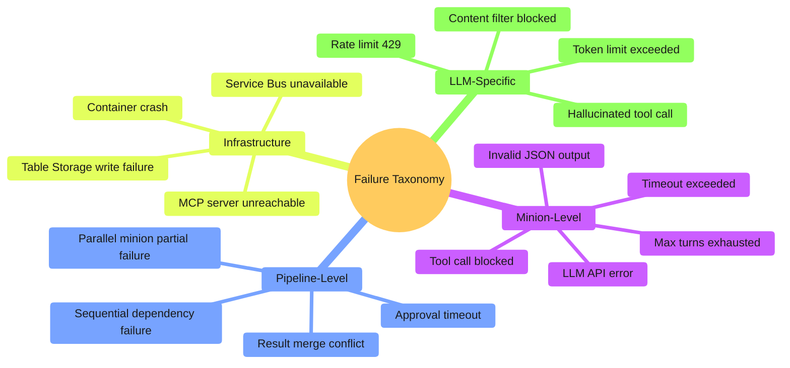
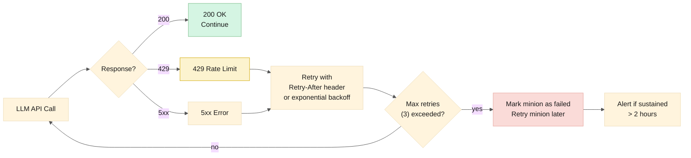
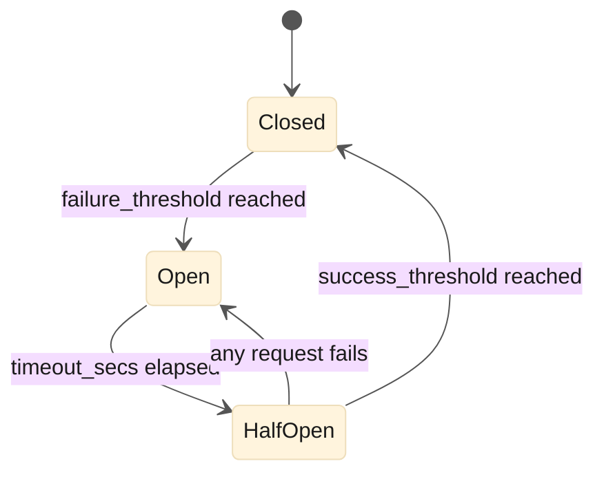

# Error Handling Patterns

> **Date:** 2026-06-06  
> **Status:** Draft  
> **Scope:** Every failure mode and how the framework handles it

---

## Table of Contents

1. [Design Principles](#design-principles)
2. [Failure Taxonomy](#failure-taxonomy)
3. [Minion-Level Failures](#minion-level-failures)
4. [Pipeline-Level Failures](#pipeline-level-failures)
5. [Infrastructure Failures](#infrastructure-failures)
6. [LLM Failures](#llm-failures)
7. [User-Facing Error Communication](#user-facing-error-communication)
8. [Error Recovery Patterns](#error-recovery-patterns)
9. [Circuit Breakers](#circuit-breakers)

---

## Design Principles

| Principle | Rule |
|---|---|
| **Fail loud, recover quiet** | The user is told something went wrong. Recovery happens automatically where possible. |
| **Partial is better than nothing** | If 2 of 3 parallel minions succeed, the user gets partial results with a warning — not silence. |
| **Never lose a task** | Service Bus dead-letter is the last resort. Tasks are retried, escalated, or replayed — never silently dropped. |
| **Correlation ID is the lifeline** | Every error message includes the correlation ID. The user or operator can trace from the error to the full session tree in the dashboard. |
| **Degrade, don't crash** | If AI Foundry is throttling, wait and retry. If ServiceNow MCP is down, tell the user — don't crash the orchestrator. |

---

## Failure Taxonomy



---

## Minion-Level Failures

### 1. Timeout Exceeded

```
Scenario: Code Reviewer minion exceeds its 600-second timeout.

┌─────────────────────────────────────────────────────────────┐
│ Orchestrator detects timeout via Monitor polling.            │
│                                                              │
│ Attempt 1: Timeout after 600s.                               │
│   → Orchestrator terminates delegate.                        │
│   → Status: timed_out.                                      │
│                                                              │
│ Attempt 2: Retry with exponential backoff (30s delay).       │
│   → If PR diff is large, orchestrator splits into chunks     │
│     and spawns multiple reviewers (mitigation).              │
│                                                              │
│ Attempt 3: Final retry (60s delay).                          │
│   → If timeout again: dead-letter.                           │
│                                                              │
│ User sees: "⚠️ PR review for #342 timed out after 3 attempts │
│            The diff may be too large (2,400 lines).           │
│            Session: corr_a1b2c3 — [View Details]"            │
└─────────────────────────────────────────────────────────────┘
```

### 2. Invalid JSON Output

```
Scenario: PR Crafter returns malformed JSON.

┌─────────────────────────────────────────────────────────────┐
│ Orchestrator Collector validates output against JSON schema. │
│                                                              │
│ Validation error: missing required field "pr_url".           │
│                                                              │
│ Attempt 1: Orchestrator retries the minion with a note:      │
│   "Your previous output was missing 'pr_url'. Include it."   │
│                                                              │
│ Attempt 2: If still invalid, the orchestrator extracts       │
│   whatever partial fields it can (branch name, commits)     │
│   and returns partial results with a warning.               │
│                                                              │
│ Reason: The PR may have been created (side effect) even      │
│   though the minion failed to report it properly.            │
│   Partial reporting prevents duplicate PRs.                  │
└─────────────────────────────────────────────────────────────┘
```

### 3. Tool Call Blocked by Allowlist

```
Scenario: Code Reviewer attempts to call servicenow.query_incidents.

┌─────────────────────────────────────────────────────────────┐
│ mcp-toolshed blocks the call before it reaches ServiceNow.   │
│                                                              │
│ Logged as: security event (blocked_by_allowlist).            │
│                                                              │
│ The minion receives an error:                                │
│   "Tool 'servicenow.query_incidents' is not in your          │
│    allowlist. Available tools: github.*, filesystem.*, ..."   │
│                                                              │
│ If the minion persists (3 blocked calls in one run):         │
│   → Orchestrator terminates the minion.                      │
│   → Flags the session for operator review.                   │
│   → Possible prompt issue — the minion is trying to do       │
│     something outside its scope.                             │
└─────────────────────────────────────────────────────────────┘
```

### 4. Hallucinated Tool Call

```
Scenario: Minion calls "github.delete_repo" — a tool that doesn't exist.

┌─────────────────────────────────────────────────────────────┐
│ The LLM hallucinates a tool name.                            │
│                                                              │
│ mcp-toolshed: "Tool 'github.delete_repo' not found in MCP    │
│               server 'github'. Available tools: get_pr,      │
│               create_pr, get_pr_diff, ..."                   │
│                                                              │
│ This error is returned to the minion as a tool result.       │
│ The LLM can correct itself in the next turn:                 │
│   "I apologize — I'll use the available tools instead."      │
│                                                              │
│ If the minion persists in calling non-existent tools:        │
│   → Marks the run as failed after 3 attempts.                │
│   → This is a prompt quality signal — the minion's prompt    │
│     may need to emphasize that only listed tools exist.      │
└─────────────────────────────────────────────────────────────┘
```

---

## Pipeline-Level Failures

### 5. Parallel Minion Partial Failure

```
Scenario: Ticket→fix→pr pipeline. Ticket Analyst succeeds.
          Code Explorer times out.

┌─────────────────────────────────────────────────────────────┐
│ Phase 1 runs 2 minions in parallel:                          │
│   ✅ Ticket Analyst (corr_a1b2c3.1) — complete               │
│   ❌ Code Explorer (corr_a1b2c3.2) — timed out               │
│                                                              │
│ Orchestrator decision tree:                                  │
│                                                              │
│ Can Phase 2 proceed without Code Explorer?                   │
│   → Possibly. PR Crafter can use grep/search as a fallback.  │
│   → Orchestrator marks the pipeline as "degraded" and        │
│     passes a warning to Phase 2: "Code location is uncertain.│
│     Fall back to broad search patterns."                     │
│                                                              │
│ Can Phase 2 NOT proceed?                                     │
│   → If Code Explorer was critical, the orchestrator retries  │
│     Code Explorer with a narrower scope.                     │
│   → If still fails, the pipeline fails. User is told which    │
│     step failed and why.                                     │
│                                                              │
│ User sees (partial):                                         │
│   "⚠️ Partially completed:                                   │
│    ✅ Ticket INC00421 analyzed (auth timeout bug)             │
│    ❌ Code location not found (explorer timed out)            │
│    ❌ PR not created                                         │
│    Session: corr_a1b2c3 — [View Details] [Retry Explorer]"   │
└─────────────────────────────────────────────────────────────┘
```

### 6. Sequential Dependency Failure

```
Scenario: Phase 2 (PR Crafter) depends on Phase 1 results.
          Phase 1 succeeds. Phase 2 fails.

┌─────────────────────────────────────────────────────────────┐
│ The pipeline is partially complete:                          │
│   ✅ Phase 1: Ticket analyzed + code located                 │
│   ❌ Phase 2: PR creation failed                             │
│                                                              │
│ Orchestrator preserves Phase 1 results as artifacts.         │
│ Phase 2 is retried with the same context.                    │
│                                                              │
│ After max retries:                                           │
│   → Pipeline fails. Phase 1 results are saved.               │
│   → User is offered: [Retry PR Creation] — re-runs Phase 2   │
│     with the preserved Phase 1 context. No re-work.          │
│                                                              │
│ User sees:                                                   │
│   "❌ PR creation failed after 3 attempts.                   │
│    Cause: GitHub API rate limit exceeded.                    │
│    Phase 1 results preserved (context saved).                │
│    [Retry PR Creation] — no re-work needed."                 │
└─────────────────────────────────────────────────────────────┘
```

### 7. Approval Timeout

```
Scenario: Orchestrator requests approval for a PR merge.
          No human responds within 4 hours.

┌─────────────────────────────────────────────────────────────┐
│ Default timeout: 4 hours (configurable in governance.yaml).  │
│                                                              │
│ Orchestrator's Timeout Handler:                              │
│   1. Marks the approval as "timed_out" in SQLite.            │
│   2. Posts to the channel:                                   │
│      "⏰ Approval request expired (no response in 4 hours).   │
│       PR #892 remains open. [Re-request Approval]"           │
│   3. Does NOT merge, close, or delete anything.              │
│   4. Escalates to the channel (not just the original user).  │
│                                                              │
│ The PR remains open. The user can re-request approval        │
│ or handle it manually.                                       │
│                                                              │
│ Default is always "deny on timeout" — never auto-approve.    │
└─────────────────────────────────────────────────────────────┘
```

---

## Infrastructure Failures

### 8. MCP Server Unreachable

```mermaid
%%{init: {'theme': 'base', 'themeVariables': { 'primaryTextColor': '#1a1a1a', 'lineColor': '#555'}}}%%
flowchart TB
    call["Minion calls\nServiceNow MCP"]
    health{"Health check\npassing?"}
    circuit_breaker{"Circuit breaker\nopen?"}
    block["Return error to minion:\n'ServiceNow unavailable.\nTry again in {retry_after}s.'"]
    fast_fail["Return immediately:\n'ServiceNow is down.\nCircuit breaker open.'"]
    success["Forward call\nto MCP server"]
    retry["Minion retries with\nother tools or waits"]
    escalate["After 3 minion-level\nretries: escalate"]
    
    call --> health
    health -->|"yes"| circuit_breaker
    health -->|"no"| block
    circuit_breaker -->|"closed"| success
    circuit_breaker -->|"open"| fast_fail
    block --> retry
    fast_fail --> retry
    retry --> escalate
    
    style call fill:#d6eaf8,stroke:#7fb3d8,color:#1a1a1a
    style block fill:#fadbd8,stroke:#e6a8a0,color:#1a1a1a
    style fast_fail fill:#f1948a,stroke:#c0392b,color:#1a1a1a
    style success fill:#d5f5e3,stroke:#82c091,color:#1a1a1a
```

The `mcp-toolshed` Health Monitor pings each MCP server every 30 seconds. After 3 consecutive failures, the circuit breaker opens. While open, calls fast-fail — the minion is told immediately rather than waiting for a timeout.

Circuit breaker half-opens after 60 seconds. If the next health check passes, it closes.

### 9. Service Bus Unavailable

```
Scenario: Azure Service Bus is experiencing an outage.

┌─────────────────────────────────────────────────────────────┐
│ Impact: Async minions cannot be enqueued.                    │
│                                                              │
│ Orchestrator behavior:                                       │
│   1. Sync tasks continue to work (they don't use SB).        │
│   2. Async tasks are queued in-memory (SQLite) as "pending". │
│   3. Orchestrator retries SB send with exponential backoff.  │
│   4. If SB is unavailable > 5 minutes:                       │
│      → Alert fires (Sev-1).                                  │
│      → Bot tells the user:                                   │
│        "⚠️ Task queued but delayed — Service Bus outage.     │
│         Your request will be processed when the queue        │
│         recovers. Session: corr_a1b2c3"                      │
│   5. When SB recovers, pending tasks are flushed.            │
│                                                              │
│ No tasks are lost — they sit in SQLite until SB accepts them.│
└─────────────────────────────────────────────────────────────┘
```

---

## LLM Failures

### 10. Rate Limit (429)



### 11. Content Filter Block

```
Scenario: User's Slack message contains content that triggers
          Azure AI Content Safety.

┌─────────────────────────────────────────────────────────────┐
│ AI Foundry blocks the request before the LLM sees it.        │
│                                                              │
│ Goose receives: HTTP 400 with content_filter_result.         │
│                                                              │
│ Orchestrator:                                                │
│   1. Logs the event (correlation ID, filter category,        │
│      severity).                                              │
│   2. Does NOT retry (retrying blocked content is pointless). │
│   3. Responds to user:                                       │
│      "⚠️ Your request was blocked by content safety filters. │
│       Category: prompt_injection, Severity: high              │
│       If this is an error, please rephrase your request."    │
│                                                              │
│ The original message content is NOT logged beyond the        │
│ session record — it stays in SQLite, not Log Analytics.      │
└─────────────────────────────────────────────────────────────┘
```

### 12. Token Limit Exceeded

```
Scenario: Code Reviewer receives a 15,000-line diff.
          Context window would exceed the model's limit.

┌─────────────────────────────────────────────────────────────┐
│ Detection: The orchestrator estimates context size before    │
│ spawning the minion. If the diff exceeds max_context_tokens: │
│                                                              │
│ Mitigation A (auto): Split the diff into chunks.             │
│   → Spawn N Code Reviewer minions, one per chunk.            │
│   → Merge review results.                                    │
│                                                              │
│ Mitigation B (fallback): If chunking also fails:             │
│   → Spawn a Code Explorer first to identify the high-risk    │
│     files within the diff.                                    │
│   → Review only those files.                                 │
│   → Flag remaining files as "not reviewed — diff too large." │
│                                                              │
│ User sees:                                                   │
│   "⚠️ Diff too large for full review (15,200 lines).         │
│    Reviewed: 8 high-risk files (2,400 lines).                │
│    Skipped: 42 low-risk files (12,800 lines).                │
│    [Review Remaining Files]"                                 │
└─────────────────────────────────────────────────────────────┘
```

---

## User-Facing Error Communication

### Message Template

Every error message follows a consistent pattern:

```
{severity_icon} {one-line summary}
{Cause: what went wrong}
{Impact: what the user should know}
{Action: what the user can do next}
Session: {correlation_id} — [View Details]
```

### Examples

```
✅ Success:
"PR #892 created: fix(auth): resolve login timeout (INC00421)
│ Review: 2 minor suggestions
│ [View PR] [Approve]"

⚠️ Degraded:
"⚠️ Partially completed:
✅ Ticket INC00421 analyzed
❌ Code location uncertain (explorer timed out)
❌ PR not created
Session: corr_a1b2c3 — [View Details] [Retry]"

❌ Failure:
"❌ Unable to review PR #342
Cause: GitHub API rate limit exceeded (50 req/min)
Impact: Review not posted. PR #342 remains unreviewed.
Action: Review will be retried automatically in 2 minutes.
Session: corr_a1b2c3 — [View Details] [Retry Now]"

🔴 Infrastructure:
"🔴 ServiceNow MCP is currently unreachable
Cause: Connection timeout after 30 seconds
Impact: Ticket queries are unavailable. Other functions work normally.
Action: The team has been alerted. Retrying automatically.
Session: corr_a1b2c3 — [View Details]"
```

---

## Error Recovery Patterns

### Retry Strategies

| Failure Type | Strategy | Max Attempts | Backoff |
|---|---|---|---|
| Minion timeout | Retry with scope reduction | 3 | 30s, 60s, 120s |
| Invalid JSON | Retry with format hint | 2 | 5s, 15s |
| LLM 429 | Retry with Retry-After | 5 | Server-specified |
| LLM 5xx | Retry | 3 | 1s, 5s, 30s |
| MCP timeout | Retry | 2 | 10s, 30s |
| MCP unreachable | Circuit breaker | — | Half-open after 60s |
| Service Bus unavailable | Local queue + retry | ∞ | 5s → 30s → 60s |
| Allowlist block | No retry | — | Escalate immediately |

### Escalation Path

```
Minion fails after max retries
        │
        ▼
Service Bus Dead-Letter Queue
        │
        ▼
Grafana alert: "DLQ has messages" (Sev-2)
        │
        ▼
Operator inspects via dashboard (correlation ID)
        │
        ├── Replay: re-enqueue with same params
        ├── Modify: adjust params and re-enqueue
        └── Discard: acknowledge and close
```

---

## Circuit Breakers

The `mcp-toolshed` implements circuit breakers per MCP server:

```yaml
# Circuit breaker configuration (in mcp-toolshed extension config)
circuit_breakers:
  github:
    failure_threshold: 5       # consecutive failures to open
    success_threshold: 2       # consecutive successes to close
    timeout_secs: 60           # half-open after this many seconds
    half_open_max_requests: 1  # allow 1 request through when half-open

  servicenow:
    failure_threshold: 3
    success_threshold: 2
    timeout_secs: 120          # longer timeout for SN (slower recovery)
    half_open_max_requests: 1

  azure_devops:
    failure_threshold: 5
    success_threshold: 3
    timeout_secs: 60
    half_open_max_requests: 2
```

State transitions:



When a circuit breaker is open, all calls to that MCP server fast-fail. The minion receives an immediate error response with `retry_after` seconds — no timeout wait.
