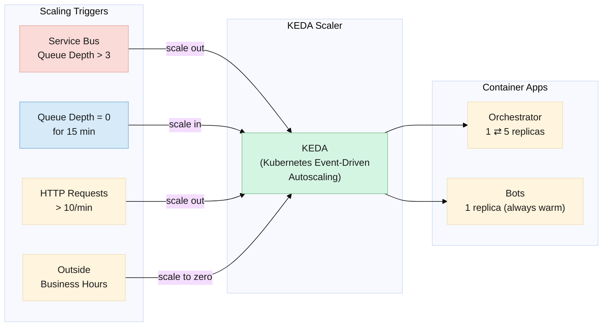
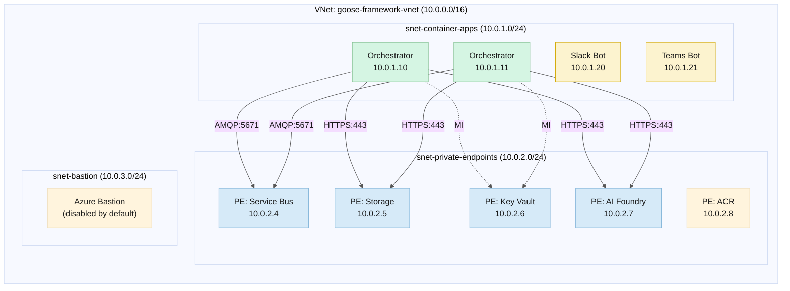
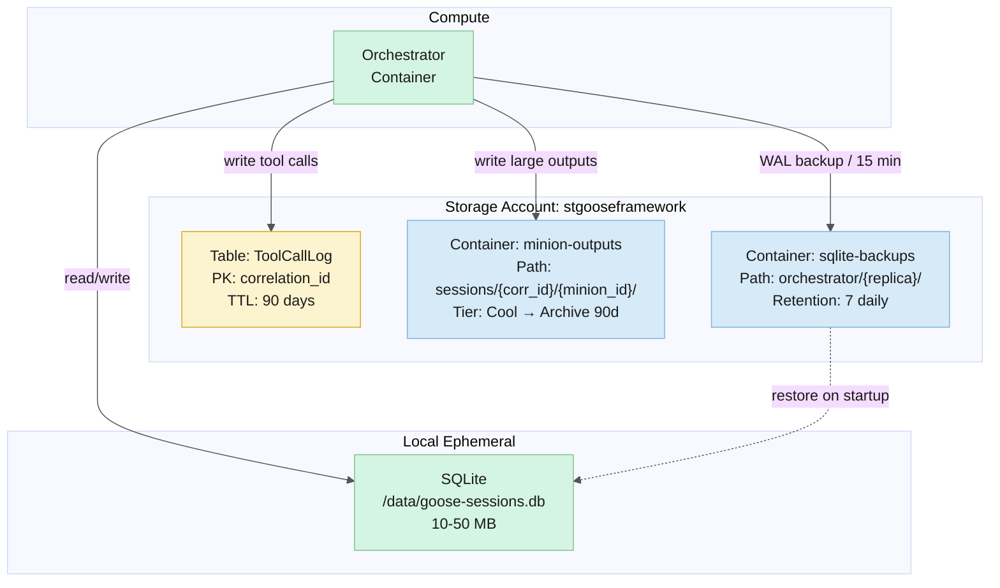
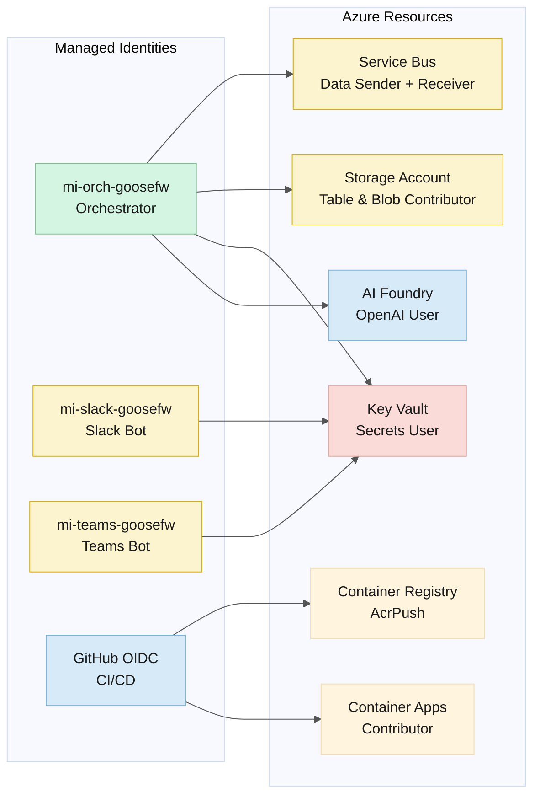
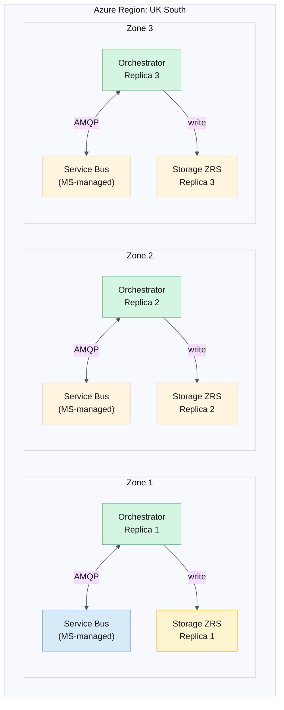
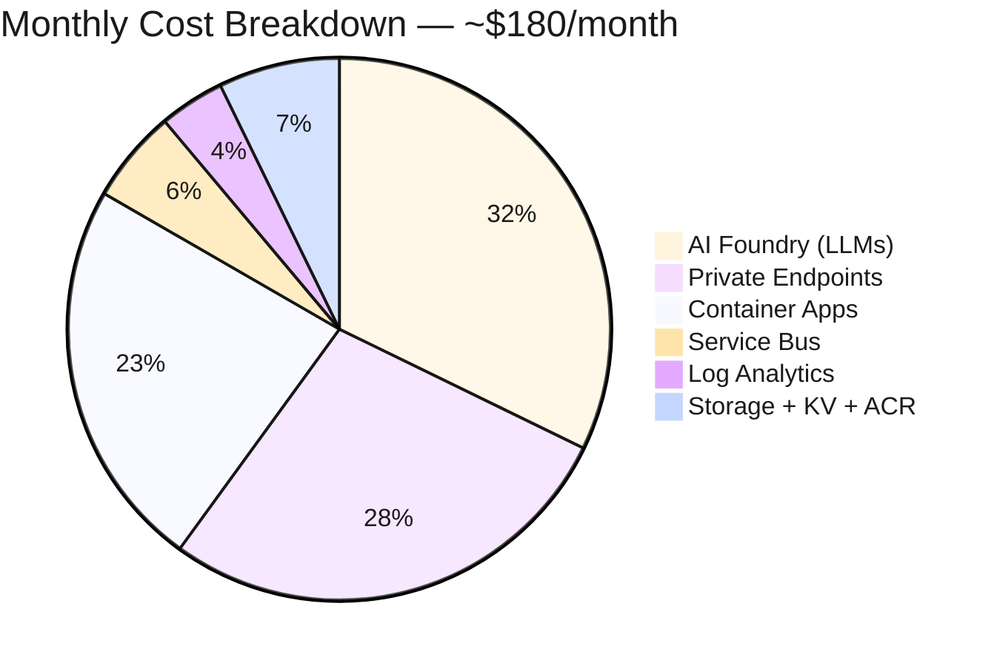
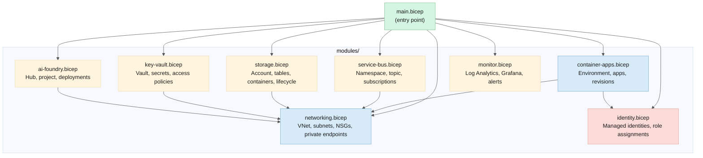

# Physical Architecture Design

> **Date:** 2026-06-06  
> **Status:** Draft  
> **Complements:** [logical-architecture.md](./logical-architecture.md), [azure-architecture.md](./azure-architecture.md)

---

## Table of Contents

1. [Design Principles](#design-principles)
2. [Compute Sizing](#compute-sizing)
3. [Networking Design](#networking-design)
4. [Storage Layout](#storage-layout)
5. [Messaging Throughput](#messaging-throughput)
6. [Identity & Access](#identity--access)
7. [High Availability](#high-availability)
8. [Disaster Recovery](#disaster-recovery)
9. [Scaling Model](#scaling-model)
10. [Cost Model](#cost-model)

---

## Design Principles

| Principle | Constraint |
|---|---|
| **Serverless-first** | No VMs, no Kubernetes clusters. Container Apps + managed services. |
| **Scale-to-zero** | Zero cost when idle. Warm replica kept during business hours (08:00–18:00 local). |
| **Private network** | All service-to-service traffic over VNet. No public IPs except Slack/Teams ingress. |
| **Single region, zone-redundant** | One Azure region, services spread across availability zones. No multi-region in initial scope. |
| **Right-size, not over-provision** | Start small. Scale with usage data. No pre-provisioned capacity beyond AI Foundry PTU (optional). |
| **Immutable infrastructure** | All resources defined in Bicep. Deployed via GitHub Actions. No ClickOps. |

---

## Compute Sizing

### Container Apps Environment

| Resource | SKU | vCPU | Memory | Replicas (min–max) |
|---|---|---|---|---|
| **Orchestrator** | Consumption-only | 1.0 | 2 GB | 1–5 |
| **Slack Bot** | Consumption-only | 0.5 | 1 GB | 1 (always warm) |
| **Teams Bot** | Consumption-only | 0.5 | 1 GB | 1 (always warm) |
| **MCP Sidecars** (filesystem, git, shell) | Consumption-only | 0.25 | 0.5 GB | 1 per orchestrator replica |

**Scaling triggers:**

| Component | Scaler | Metric | Threshold |
|---|---|---|---|
| Orchestrator | KEDA Service Bus | Queue depth > 3 messages | +1 replica |
| Orchestrator | KEDA Service Bus | Queue depth = 0 for 15 min | Scale to 1 (or 0 outside business hours) |
| Bots | KEDA HTTP | Requests > 10/min | +1 replica (rarely needed) |
| MCP Sidecars | Colocated | Same as orchestrator | Inherits orchestrator scaling |

**Why consumption-only (not Dedicated):**


- Dedicated plan minimum: ~$150/month for always-warm workers
- Consumption plan: pay per-second for active containers, scale-to-zero
- Orchestrator CPU bound only during intent classification and response synthesis — seconds per session
- Minions run as delegates within the orchestrator process, not separate containers
- Estimated active compute: ~2–4 hours/day at moderate usage → ~$15–30/month

**Container image:**

```
gooseframework.azurecr.io/orchestrator:latest
├── Base: Goose runtime (Node.js or Python)
├── Extensions:
│   ├── orchestrator/
│   ├── mcp-toolshed/
│   └── chatrecall/
├── Prompts: /prompts/*.md
├── Config: /config/governance.yaml
└── SQLite: /data/goose-sessions.db
```

---

## Networking Design

### VNet Layout



Three subnets in a single VNet. The container-apps subnet hosts all compute — orchestrator replicas and bot containers. The private-endpoints subnet hosts the 5-6 private endpoints that keep all Azure service traffic off the public internet. The bastion subnet exists for emergency access but is disabled by default.

All service-to-service traffic flows through private endpoints, resolving to private IPs via auto-created private DNS zones.

### DNS & Service Discovery

| Concern | Solution |
|---|---|
| Service Bus namespace DNS | `sb-goose-framework.servicebus.windows.net` → private endpoint → private IP |
| Storage account DNS | `stgooseframework.table.core.windows.net` → private endpoint → private IP |
| AI Foundry endpoint | `foundry-goose-framework.openai.azure.com` → private endpoint → private IP |
| Container-to-container | Container Apps environment-internal DNS (service name resolution) |
| Bot ingress | Public FQDN via Container Apps managed certificate: `teams-bot.<env>.azurecontainerapps.io` |

### Network Security Groups (NSGs)

| Subnet | Inbound | Outbound |
|---|---|---|
| **container-apps** | From: Internet (HTTPS:443) — only to bot containers | To: private-endpoints (HTTPS:443, AMQP:5671), Internet (MCP servers:443) |
| **private-endpoints** | From: container-apps (443, 5671) | To: Azure services (via PE) |
| **bastion** | From: Azure Bastion (443) | To: container-apps (22) — disabled by default |

### Firewall / WAF

Not needed in initial scope. Container Apps provides DDoS protection at the platform level. Bot endpoints are authenticated (Slack signing secret, Teams Bot Framework auth). No sensitive data is exposed on public endpoints.

---

## Storage Layout

### Storage Account: `stgooseframework`



Three stores, three purposes. Table Storage for the append-only immutable tool call log. Blob Storage for large artifacts (full minion outputs, diffs) and SQLite backups. SQLite for hot session state — local to the orchestrator container, backed up every 15 minutes, restored on container start.

```
Storage Account: stgooseframework
├── Table: ToolCallLog
│   ├── Partition Key: {correlation_id}
│   ├── Row Key: {timestamp_ticks}_{minion_type}_{tool_name}
│   ├── TTL: 90 days (auto-delete)
│   └── Redundancy: LRS (zone-redundant for production)
│
├── Blob Container: minion-outputs
│   ├── Path: sessions/{correlation_id}/{minion_id}/output.json
│   ├── Tier: Cool (auto-transition to Archive after 90 days)
│   ├── Immutability: Legal hold on tool call data (optional, for compliance)
│   └── Redundancy: LRS (zone-redundant for production)
│
├── Blob Container: sqlite-backups
│   ├── Path: orchestrator/{replica_id}/sessions-{timestamp}.sqlite-wal
│   ├── Retention: 7 daily backups
│   └── Tier: Cool
│
└── Blob Container: prompts
    ├── Path: prompts/{minion_type}/{version}.md
    └── Optional: source of truth is Git; Blob is deployment cache
```

### SQLite (ephemeral, per orchestrator replica)

```
Location: /data/goose-sessions.db (within container)
Size: ~10–50 MB typical, grows with active sessions
Backup: WAL checkpoint every 15 minutes → Blob (sqlite-backups container)
Recovery: On container start, check Blob for latest backup. Restore if present.
```

### Capacity Planning

| Resource | 10 sessions/day | 100 sessions/day | 1,000 sessions/day |
|---|---|---|---|
| Table Storage (tool calls) | ~1 MB/month | ~10 MB/month | ~100 MB/month |
| Blob Storage (outputs) | ~50 MB/month | ~500 MB/month | ~5 GB/month |
| SQLite | <10 MB | <50 MB | <200 MB (rotate with backup) |
| Log Analytics ingestion | ~100 MB/month | ~1 GB/month | ~10 GB/month |

All well within free/cheapest tier limits.

---

## Messaging Throughput

### Service Bus: `sb-goose-framework`

| Resource | SKU | Throughput |
|---|---|---|
| Namespace | Standard | Up to 1,000 msg/sec |
| Topic: `minion-tasks` | — | Shared namespace throughput |
| Subscription: `code-explorer` | — | Max delivery count: 3 |
| Subscription: `code-reviewer` | — | Max delivery count: 3 |
| Subscription: `pr-crafter` | — | Max delivery count: 3 |
| Subscription: `ticket-analyst` | — | Max delivery count: 3 |
| Subscription: `security-auditor` | — | Max delivery count: 3 |

**Message size:** ~2–10 KB typical (instructions + context object). Blob reference for large context payloads (>200 KB).

**Session model:** Session ID = correlation ID. FIFO per session. Prevents a session's Phase 2 minion from running before Phase 1 completes.

**Dead-letter:** Max delivery count = 3 → DLQ. Operator inspects via dashboard, replays or discards.

**Duplicate detection:** Enabled per topic. Prevents double-dispatch if the orchestrator retries a `send`.

---

## Identity & Access

### Managed Identities

| Resource | Identity Type | Purpose |
|---|---|---|
| Orchestrator Container App | User-assigned managed identity | Authenticate to: Service Bus, Table Storage, Blob Storage, Key Vault, AI Foundry |
| Slack Bot Container App | User-assigned managed identity | Authenticate to: Key Vault (for Slack signing secret) |
| Teams Bot Container App | User-assigned managed identity | Authenticate to: Key Vault (for Teams bot credentials) |
| GitHub Actions (CI/CD) | Federated credential (OIDC) | Authenticate to Azure for deployments |

### Key Vault: `kv-goose-framework`

```
Secret: github-pat            → GitHub MCP authentication
Secret: ado-pat               → Azure DevOps MCP authentication
Secret: servicenow-password   → ServiceNow MCP authentication
Secret: jira-api-token        → Jira MCP authentication
Secret: slack-signing-secret  → Slack bot verification
Secret: teams-bot-password    → Teams bot authentication
```

**No LLM API keys** — AI Foundry uses managed identity.

### RBAC Roles



**Four identities, least privilege.** The Orchestrator has broadest access (Service Bus, Storage, Key Vault, AI Foundry). Bots only read their own secrets from Key Vault. CI/CD (GitHub OIDC) can push containers and update apps but never reads secrets or production data. Key Vault (red) is the only credential store — no secrets in container env vars or config files.

| Identity | Scope | Role |
|---|---|---|
| Orchestrator MI | Service Bus | Azure Service Bus Data Sender, Data Receiver |
| Orchestrator MI | Storage Account | Storage Table Data Contributor |
| Orchestrator MI | Storage Account | Storage Blob Data Contributor |
| Orchestrator MI | AI Foundry | Cognitive Services OpenAI User |
| Orchestrator MI | Key Vault | Key Vault Secrets User (for MCP creds) |
| GitHub OIDC | Container Registry | AcrPush |
| GitHub OIDC | Container Apps | Contributor (for deployments) |

---

## High Availability

### Availability Zone Redundancy



**Zone-redundant where it matters.** Container Apps automatically distributes replicas across zones when ≥3 are running. Service Bus Standard tier provides Microsoft-managed paired-region redundancy. Storage uses ZRS in production (3 synchronous copies across zones). If Zone 1 fails, replicas in Zones 2 and 3 continue processing with no data loss.

| Resource | Zone Redundancy | Notes |
|---|---|---|
| Container Apps | Automatic (when ≥3 replicas) | Replicas spread across zones |
| Service Bus (Standard) | Automatic (paired regions) | Microsoft-managed |
| Table Storage | LRS (zone-redundant for production) | ZRS recommended for production |
| Blob Storage | LRS (zone-redundant for production) | ZRS recommended for production |
| Key Vault | Automatic (within region) | Microsoft-managed |
| AI Foundry | Deployment-specific | Deploy to multiple zones for HA |
| Log Analytics | Automatic | Microsoft-managed |

### Single Points of Failure

| Component | SPOF? | Mitigation |
|---|---|---|
| Orchestrator | No (multi-replica) | KEDA scales to ≥2 during active sessions |
| Service Bus | No (Microsoft-managed, 99.9% SLA Standard) | Acceptable |
| Table Storage | No (Microsoft-managed, 99.9% SLA) | Acceptable |
| AI Foundry | Yes (single deployment) | Deploy to 2+ zones; fallback deployment in same region |
| Container Registry | No (Microsoft-managed, geo-replicated optional) | Geo-replication for production |
| SQLite (per replica) | Yes (local storage) | 15-min WAL backup to Blob; restore on restart |

### Recovery Time Objectives

| Scenario | RTO | RPO |
|---|---|---|
| Single orchestrator replica crash | <30 seconds (new replica spawns, loads SQLite from Blob) | <15 minutes (last WAL backup) |
| All orchestrator replicas crash | <2 minutes (KEDA respawns) | <15 minutes |
| Zone failure | <5 minutes (replicas shift to surviving zones) | <15 minutes |
| Region failure | Not in scope for initial design | Multi-region is a future enhancement |

---

## Scaling Model

### Horizontal Scaling

```
                     KEDA Scaler
                         │
              ┌──────────┴──────────┐
              │                     │
    Service Bus Queue        HTTP Requests
    (orchestrator)           (bots)
              │                     │
              ▼                     ▼
    Queue depth > 3     Requests > 10/min
    → +1 replica        → +1 replica
              │                     │
              ▼                     ▼
    Queue depth = 0     Requests < 1/min
    for 15 min →        for 10 min →
    scale to 1          scale to 1
    (or 0 off-hours)    (or 0 off-hours)
```

### Vertical Scaling

Container Apps consumption plan auto-sizes vCPU/memory within configured limits:

| Component | vCPU Max | Memory Max | Rationale |
|---|---|---|---|
| Orchestrator | 2.0 | 4 GB | Intent classification + DAG can be CPU-heavy |
| Bots | 1.0 | 2 GB | Lightweight adapters |
| MCP Sidecars | 1.0 | 1 GB | Git operations, shell commands |

### Throughput Ceiling (estimated)

| Bottleneck | Limit | Sessions/min it supports |
|---|---|---|
| LLM API rate (AI Foundry, GPT-4o-mini) | ~500 requests/min (PTU or paygo) | ~200 (assuming 2.5 LLM calls/session) |
| Service Bus | 1,000 msg/sec | Far exceeds all other limits |
| Table Storage | 20,000 transactions/sec | Far exceeds all other limits |
| Orchestrator CPU | ~10 intent classifications/sec/replica | ~100 sessions/min with 5 replicas |
| **System bottleneck** | **LLM API rate** | **~30–50 complex sessions/min** |

Bottleneck is the LLM API, not compute or storage.

---

## Cost Model

### Monthly Cost Estimate (Moderate Usage)



**LLM inference dominates at scale.** AI Foundry (token consumption) is 32% at moderate usage, rising to ~67% at heavy usage. Private endpoints are a fixed cost ($50/month for 6 endpoints). Container Apps costs are usage-based and stay flat because the orchestrator is event-driven, not always-on.

Assumptions: 50 sessions/day, 150 minion runs/day, ~3,000 tool calls/day, business hours only.

| Resource | SKU | Est. Monthly Cost |
|---|---|---|
| Container Apps (orchestrator) | Consumption, ~4 active hrs/day | $12 |
| Container Apps (bots) | Consumption, always warm × 2 | $30 |
| Container Apps (sidecars) | Consumption, colocated with orch | $0 (included) |
| Service Bus | Standard | $10 |
| Table Storage | ~3 GB + 90K ops | $2 |
| Blob Storage | ~15 GB Cool | $3 |
| Key Vault | Standard (secrets only) | $3 |
| AI Foundry — GPT-4o-mini (fast) | ~500K tokens/day, paygo | $8 |
| AI Foundry — GPT-4.1 (reasoning) | ~200K tokens/day, paygo | $30 |
| AI Foundry — Claude Sonnet (review) | ~100K tokens/day, paygo | $20 |
| Log Analytics | ~3 GB ingested/day | $7 |
| Managed Grafana | Essential (free tier) | $0 |
| Container Registry | Basic | $5 |
| VNet + Private Endpoints | 6 endpoints | $50 |
| **Total (moderate)** | | **~$180/month** |

### Monthly Cost Estimate (Light Usage — Dev/Staging)

| Resource | Adjustment | Est. Cost |
|---|---|---|
| Container Apps | Scale-to-zero, <1 hr active/day | $5 |
| AI Foundry | Minimal tokens | $15 |
| Log Analytics | Minimal ingestion | $2 |
| Private Endpoints | Reduce to 3 (SB, Storage, KV only) | $25 |
| **Total (light)** | | **~$80/month** |

### Monthly Cost Estimate (Heavy Usage — Production, 500 sessions/day)

| Resource | Adjustment | Est. Cost |
|---|---|---|
| Container Apps | Always warm, 3 replicas | $60 |
| AI Foundry | PTU for reasoning tier | $800 |
| Log Analytics | 30 GB ingested/day | $70 |
| Private Endpoints | Full set | $50 |
| **Total (heavy)** | | **~$1,200/month** |

### Cost Optimization Levers

| Lever | Saving |
|---|---|
| Scale-to-zero outside business hours | ~$20–40/month |
| Use `fast` tier for classification (not `reasoning`) | ~$200/month at scale |
| Prompt caching (repeated system prompts) | ~15–20% token reduction (when supported by model) |
| Session-level tool call caching | ~10% token reduction |
| Log Analytics data cap | Cap at 5 GB/day: ~$12/month saved |
| Archive blobs after 30 days instead of 90 | ~$5/month |

---

## Infrastructure as Code



**8 Bicep modules, one entry point.** `main.bicep` orchestrates the deployment by passing parameters to each module. Modules that require networking (Container Apps, Service Bus, Storage, Key Vault, AI Foundry) depend on `networking.bicep` for VNet + subnet IDs. `identity.bicep` is a dependency for Container Apps (managed identity assignment) and is run first.

All infrastructure is version-controlled in the same Git repo as the application code. GitHub Actions runs `az deployment group create` with the appropriate parameter file (`dev.bicepparam`, `staging.bicepparam`, `prod.bicepparam`).


