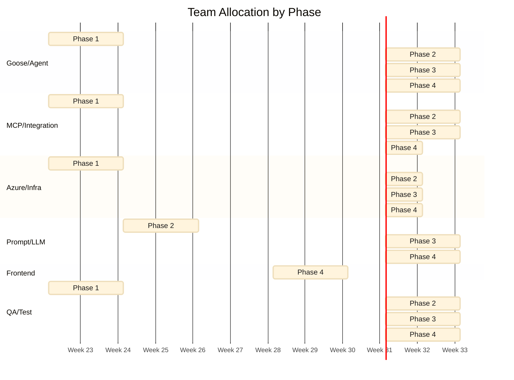

# Skills & Roles — Development and Deployment

> **Date:** 2026-06-06  
> **Purpose:** Clarify who is needed at each phase to build and operate the Goose Agent Framework.

---

## Role-to-Phase Matrix

| Role | Phase 1 Foundation | Phase 2 Minion FW | Phase 3 Ticket+Review | Phase 4 Platform | Operations Ongoing |
|---|---|---|---|---|---|
| **Goose/Agent Engineer** | 🟢 Full-time | 🟢 Full-time | 🟢 Full-time | 🟡 Half-time | 🟡 On-call |
| **MCP/Integration Engineer** | 🟢 Full-time | 🟡 Half-time | 🟢 Full-time | 🟡 Quarter-time | 🟡 On-call |
| **Azure/Infrastructure Engineer** | 🟢 Full-time | 🟡 Half-time | 🟡 Quarter-time | 🟡 Quarter-time | 🟢 On-call |
| **Prompt/LLM Engineer** | 🟡 Half-time | 🟢 Full-time | 🟢 Full-time | 🟢 Full-time | 🟡 Quarter-time |
| **Frontend/Dashboard Engineer** | — | — | — | 🟢 Full-time | 🟡 Quarter-time |
| **Security Engineer** | 🟡 Quarter-time | 🟡 Quarter-time | 🟡 Quarter-time | 🟡 Quarter-time | 🟡 On-call |
| **QA/Test Engineer** | 🟡 Half-time | 🟡 Half-time | 🟡 Half-time | 🟢 Full-time | 🟡 Quarter-time |
| **DevOps/CI/CD Engineer** | 🟡 Half-time | 🟡 Half-time | 🟡 Quarter-time | 🟡 Quarter-time | 🟢 On-call |
| **Product Owner** | 🟡 Quarter-time | 🟡 Quarter-time | 🟡 Quarter-time | 🟡 Quarter-time | 🟡 Quarter-time |

🟢 = heavily involved. 🟡 = partially involved. — = not needed yet.

---

## Role Deep-Dives

### 1. Goose/Agent Engineer

**What they do:**
- Write Goose extensions (`orchestrator`, `mcp-toolshed`, `slack-bot`, `teams-bot`, `agent-dashboard`)
- Implement the orchestrator's intent classifier, task decomposer, minion lifecycle manager
- Wire the toolshed's allowlist enforcement, rate limiter, and logging layer
- Integrate with Goose's `delegate`, `load(taskId)`, and session APIs
- Implement correlation ID propagation, structured output validation, and human-in-the-loop gating

**Skills:**
- **Must have:** TypeScript or Python (Goose's extension language). Understanding of LLM agent architectures. Experience with the Goose framework or similar agent SDKs.
- **Nice to have:** Contributed to Goose open-source. Built an agent framework before.

**Phases:**
| Phase | Focus |
|---|---|
| 1 | Scaffold `mcp-toolshed` and `orchestrator` extensions. Get `delegate` spawning working. |
| 2 | Implement DAG decomposition, minion lifecycle (spawn → monitor → collect → retry → DLQ). |
| 3 | Wire ticket and review pipelines. Implement result merging. Error handling patterns. |
| 4 | Polish. Wire the dashboard backend. Implement prompt canary logic. |
| Ops | Debug failed sessions. Tune orchestrator performance. |

---

### 2. MCP/Integration Engineer

**What they do:**
- Build and maintain MCP server connections (GitHub, Azure DevOps, ServiceNow, Jira, Slack, Teams)
- Implement the toolshed's connection pool, health checks, and circuit breakers
- Handle MCP server authentication (PATs, OAuth, basic auth → Key Vault)
- Build the MCP mock server for integration testing
- Handle MCP protocol edge cases (SSE reconnection, stdio lifecycle, large response streaming)

**Skills:**
- **Must have:** Strong TypeScript or Python. Experience with REST/SSE APIs. Understanding of MCP protocol spec. Experience with at least one of: GitHub API, Azure DevOps API, ServiceNow API.
- **Nice to have:** Written an MCP server before. Contributed to MCP SDK.

**Phases:**
| Phase | Focus |
|---|---|
| 1 | Build GitHub MCP + Azure DevOps MCP connections. MCP registry and connection pool. |
| 2 | Polish connection management. Add health checks and circuit breakers. |
| 3 | Build ServiceNow MCP + Jira MCP connections. Cross-system correlation. |
| 4 | Build Slack MCP + Teams MCP connections (for outbound bot messaging). |
| Ops | Debug MCP connectivity issues. Add new MCP servers as needed. |

---

### 3. Azure/Infrastructure Engineer

**What they do:**
- Design and deploy Azure infrastructure via Bicep
- Configure VNet, subnets, private endpoints, NSGs, DNS
- Provision Container Apps environment, Service Bus, Storage, Key Vault, AI Foundry
- Set up managed identities and RBAC roles
- Configure Log Analytics, Grafana, and alert rules
- Implement CI/CD via GitHub Actions with OIDC to Azure
- Manage environments (dev, staging, prod) with per-environment Bicep parameters

**Skills:**
- **Must have:** Azure infrastructure experience (Container Apps, networking, Service Bus, Key Vault). Bicep or Terraform. Managed identity and RBAC. GitHub Actions.
- **Nice to have:** Azure AI Foundry experience. KEDA autoscaling. Azure Policy.

**Phases:**
| Phase | Focus |
|---|---|
| 1 | Deploy base infrastructure (VNet, Container Apps, Service Bus, Storage, Key Vault, ACR). |
| 2 | Deploy AI Foundry hub, project, model deployments. Wire networking. |
| 3 | Add Log Analytics, Grafana, alert rules. Configure environments. |
| 4 | Production hardening. Cost optimization. PTU provisioning. |
| Ops | Monitor infrastructure. Respond to alerts. Scale resources. |

---

### 4. Prompt/LLM Engineer

**What they do:**
- Write and iterate on minion system prompts (5 minion types)
- Design output JSON schemas per minion
- Build and maintain the prompt quality test case bank (50-100 cases per minion)
- Run prompt canary evaluations — compare candidate vs. baseline on quality metrics
- Tune model tier selection (which tier for which task)
- Monitor token consumption and optimize for cost
- Handle LLM-specific failure modes (hallucinated tools, content filter blocks, token limits)

**Skills:**
- **Must have:** Prompt engineering experience on production systems. Understanding of LLM failure modes. JSON Schema. Familiarity with at least one evals framework.
- **Nice to have:** Experience with multi-model routing. Code review experience (for Code Reviewer prompt). Security background (for Security Auditor prompt).

**Phases:**
| Phase | Focus |
|---|---|
| 1 | Draft initial prompts for Code Explorer (simple search → read → analyze flow). |
| 2 | Draft prompts for all 5 minion types. Design initial output schemas. Set up test case bank. |
| 3 | Iterate Ticket Analyst and Code Reviewer prompts based on real ticket data. |
| 4 | Run canary deployments. Measure prompt quality metrics. Continuous prompt improvement. |
| Ops | Monitor prompt quality dashboards. Respond to regressions. Add test cases from production. |

**This role is the hardest to hire for.** Prompt engineering for agentic systems is a new discipline. Ideal candidates have:
- Built and iterated on system prompts for production agents
- Experience measuring prompt quality quantitatively (not just "looks better")
- Understanding of how prompts interact with tool calling (the LLM must know when to call a tool vs. reason in-text)

A strong senior engineer from the Goose/Agent role can grow into this.

---

### 5. Frontend/Dashboard Engineer

**What they do:**
- Build the `agent-dashboard` Goose extension (Phase 4) using `apps__create_app` or a standalone framework
- Implement 6 views: Session Explorer, Correlation Tree, Live Minion Status, Tool Call Inspector, Prompt Viewer, Governance Config
- Read from Table Storage and Log Analytics APIs
- Implement correlation tree DAG visualization
- Build the governance config editor with validation and PR flow

**Skills:**
- **Must have:** Frontend development (React/Vue/Svelte). Data visualization (D3.js or similar — for correlation tree). REST API consumption. Azure SDK for JS (Table Storage queries).
- **Nice to have:** Experience with observability dashboards. UX design.

**Phases:**
| Phase | Focus |
|---|---|
| 1–3 | Not needed. Grafana covers operational needs. |
| 4 | Build full dashboard. Iterate on UX with feedback from operators. |
| Ops | Bug fixes. Feature requests from operators. |

---

### 6. Security Engineer

**What they do:**
- Review tool allowlists and path scopes for gaps
- Audit Key Vault RBAC and secret rotation
- Review managed identity role assignments for least privilege
- Penetration test the toolshed's allowlist enforcement
- Review content safety configuration in AI Foundry
- Validate that Team A cannot access Team B's data (multi-tenancy isolation)
- Review governance config changes for security implications

**Skills:**
- **Must have:** Azure security (RBAC, managed identity, Key Vault, NSGs). API security. LLM security concepts (prompt injection, data exfiltration).
- **Nice to have:** MCP protocol security. Agent framework security.

**Phases:**
| Phase | Focus |
|---|---|
| 1 | Review base infrastructure security model. Approve RBAC design. |
| 2 | Review allowlist configurations per minion. |
| 3 | Pen-test toolshed enforcement. Validate ServiceNow/Jira integration auth. |
| 4 | Full security review before production. Multi-tenancy isolation testing. |
| Ops | Ongoing security monitoring. Respond to Defender for Cloud alerts. |

---

### 7. QA/Test Engineer

**What they do:**
- Write and maintain unit tests (orchestrator components, toolshed components)
- Write and maintain integration tests (mock MCP servers, pipeline scenarios)
- Build and maintain the prompt quality test harness
- Write E2E test scenarios and run them nightly
- Write chaos test scripts and run them weekly
- Maintain the MCP mock server with realistic canned responses
- Run cross-platform parity tests (GitHub vs. ADO)

**Skills:**
- **Must have:** Strong TypeScript or Python testing. Integration test design. Mock server design. Familiarity with at least one test framework (Jest, pytest, etc.).
- **Nice to have:** Chaos engineering experience (k6, Artillery, Gremlin). Prompt evaluation experience.

**Phases:**
| Phase | Focus |
|---|---|
| 1 | Set up test infrastructure. Write unit + integration tests for toolshed. |
| 2 | Write integration tests for orchestrator pipelines. Set up MCP mock server. |
| 3 | Write prompt quality test harness. Build E2E test scenarios. |
| 4 | Write chaos tests. Performance tests. Cross-platform parity tests. Full test suite. |
| Ops | Maintain test suite. Add regression tests from production incidents. |

---

### 8. DevOps/CI/CD Engineer

**What they do:**
- Design and implement GitHub Actions CI/CD pipelines
- Set up OIDC federation to Azure
- Container image build and ACR push
- Bicep deployment with what-if previews
- Canary deployment support (staging → canary → full prod rollout)
- Manage environment promotion gates
- Set up branch protection rules and required status checks

**Skills:**
- **Must have:** GitHub Actions. Docker. Azure CLI. Bicep or Terraform. OIDC/workload identity.
- **Nice to have:** Azure Container Apps CI/CD. Canary deployment patterns.

**Phases:**
| Phase | Focus |
|---|---|
| 1 | Set up CI/CD foundation: build, push, deploy to dev. |
| 2 | Add staging environment. Implement canary deployment. |
| 3 | Add E2E test gates to CI. Cost report workflow. |
| 4 | Production CI/CD hardening. Secret rotation workflow. |
| Ops | Maintain pipelines. Debug deployment failures. |

---

### 9. Product Owner

**What they do:**
- Define which intents the orchestrator should handle first
- Prioritize MCP server integrations (GitHub before ADO? ServiceNow before Jira?)
- Define error messaging UX (what does the user see when a pipeline fails?)
- Decide governance defaults (which actions require human approval?)
- Gather feedback from early users and feed it into the roadmap
- Decide when the framework is ready for production

**Skills:**
- **Must have:** Product management. Understanding of developer workflows (PRs, tickets, code review). Familiarity with Slack/Teams bot UX.
- **Nice to have:** Experience with agent/AI products.

**Phases:**
| Phase | Focus |
|---|---|
| 1 | Define MVP scope. Prioritize integrations. |
| 2 | Gather feedback on minion quality. Tune error messages. |
| 3 | Validate ticket-to-PR pipeline UX. |
| 4 | Validate dashboard UX. Sign off on production readiness. |
| Ops | Continuous prioritization from user feedback. |

---

## Team Size Scenarios

### Lean Team (3–4 people)

| Person | Roles Combined |
|---|---|
| Engineer 1 | Goose/Agent + MCP/Integration |
| Engineer 2 | Azure/Infrastructure + DevOps/CI/CD |
| Engineer 3 | Prompt/LLM + QA/Test |
| (Part-time) | Security review + Product Owner (shared with another team) |

**Feasible for:** Phases 1–2. Slower progress. No dedicated frontend engineer — dashboard deferred or simplified.

### Comfortable Team (5–7 people)

| Person | Roles |
|---|---|
| Engineer 1 | Goose/Agent (lead) |
| Engineer 2 | MCP/Integration |
| Engineer 3 | Azure/Infrastructure + DevOps/CI/CD |
| Engineer 4 | Prompt/LLM |
| Engineer 5 | Frontend/Dashboard (joins Phase 4) |
| Engineer 6 | QA/Test |
| (Part-time) | Security + Product Owner |

**Feasible for:** All phases on schedule. Full dashboard in Phase 4.

### Well-Resourced Team (8+ people)

As above, plus:
- Dedicated Security Engineer throughout
- Dedicated Product Owner
- Second Prompt/LLM Engineer (one per minion family)
- Second QA/Test Engineer (one for automation, one for manual/exploratory)

---

## Skill Gaps to Watch For

The hardest roles to fill:

| Role | Why hard |
|---|---|
| **Prompt/LLM Engineer** | New discipline. Few people have production prompt engineering experience, especially for multi-minion agent systems where prompts must interact correctly with tool calling. |
| **Goose/Agent Engineer** | Goose is new. Few people have built Goose extensions. But the concepts (agent loops, tool calling, delegates) are transferable from LangChain, AutoGen, CrewAI, etc. |
| **MCP/Integration Engineer** | MCP protocol knowledge is niche. But REST API experience is common. The MCP SDK handles protocol details — the engineer needs API integration skills more than MCP expertise. |

Mitigation: hire strong generalists. Goose extensions, MCP servers, and agent prompts are all learnable by a good engineer in 1–2 weeks.

---

## Phase-by-Phase Team Focus

**Phase 1** is infrastructure-heavy (Azure Engineer + MCP Engineer). **Phases 2–3** are agent-heavy (Goose Engineer + Prompt Engineer). **Phase 4** brings in the Frontend Engineer and ramps QA.

---

## Shared Responsibilities

Some responsibilities span roles and phases:

| Responsibility | Primary | Secondary |
|---|---|---|
| **Prompt quality** | Prompt/LLM Engineer | QA/Test (test case bank), Product Owner (acceptance criteria) |
| **Allowlist design** | Goose/Agent Engineer | Security Engineer (review), Prompt Engineer (what the minion needs) |
| **Error messaging UX** | Goose/Agent Engineer | Product Owner (tone, content), Prompt Engineer (LLM-generated error messages) |
| **CI/CD pipelines** | DevOps Engineer | Azure Engineer (Bicep deployment), Goose Engineer (test integration) |
| **MCP mock server** | QA/Test Engineer | MCP/Integration Engineer (realistic responses) |
| **Cost optimization** | Azure Engineer (infra costs) | Prompt Engineer (token costs), Product Owner (budget decisions) |
