# Goose Agent Framework — Logical Architecture

> **Date:** 2026-06-05  
> **Status:** Draft  
> **Complements:** [high-level-design.md](./high-level-design.md), [adrs.md](./adrs.md)

---

## Table of Contents

1. [System Context](#system-context)
2. [Container Architecture](#container-architecture)
3. [Orchestrator Internals](#orchestrator-internals)
4. [MCP Toolshed Internals](#mcp-toolshed-internals)
5. [Minion Lifecycle](#minion-lifecycle)
6. [Sequence: Simple Query](#sequence-simple-query)
7. [Sequence: Complex Pipeline](#sequence-complex-pipeline)
8. [Sequence: Scheduled Daily PR Review](#sequence-scheduled-daily-pr-review)
9. [Data Model](#data-model)
10. [Observability Data Flow](#observability-data-flow)
11. [Azure Deployment Topology](#azure-deployment-topology)
12. [Security Boundaries](#security-boundaries)

---

## System Context

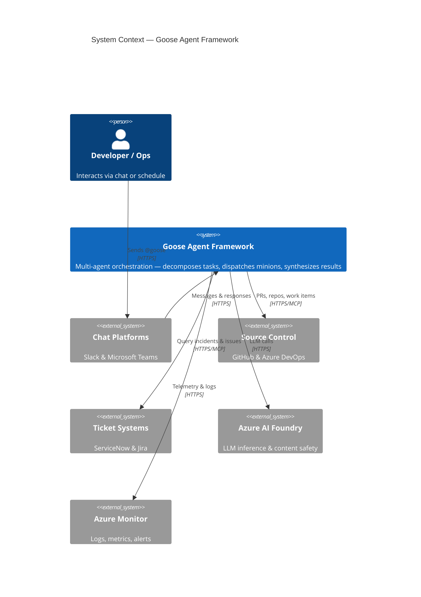

This is the broadest view — the **C4 System Context diagram**. It defines what is inside the Goose Agent Framework boundary and what sits outside as an external system or person.

- **The user** (developer or operator) never interacts with Goose directly. All communication flows through chat platforms (Slack, Microsoft Teams) or scheduled cron triggers.
- **Goose** is the central system. It receives intents, decomposes them into tasks, spins up minions, and returns synthesized results. It does not store tickets or source code — it orchestrates across systems that do.
- **External systems** are grouped by domain: Chat Platforms, Source Control (GitHub + Azure DevOps), Ticket Systems (ServiceNow + Jira), AI (Azure AI Foundry), and Observability (Azure Monitor). Each group exposes an MCP server or REST API that Goose calls.
- Every connection is **outbound from Goose** (or inbound from chat platforms). Goose never opens ingress ports to external systems — it polls, calls, or subscribes.

This diagram answers: *"What does the framework touch, and what touches it?"*

---

## Container Architecture

```mermaid
    title Container Diagram — Goose Agent Framework

    Person(user, "User", "Developer or Operator")

    System_Boundary(aca, "Azure Container Apps") {
        Container(slack_bot, "Slack Bot", "Goose Extension", "Receives @goose from Slack. Forwards to orchestrator.")
        Container(teams_bot, "Teams Bot", "Goose Extension", "Receives @goose from Teams. Renders Adaptive Cards.")
        Container(orchestrator, "Orchestrator", "Goose Extension", "Intent classification, task decomposition, minion lifecycle, session state.")
        Container(toolshed, "MCP Toolshed", "Goose Extension", "MCP connection pool, allowlist enforcement, rate limiting, tool call logging.")
        ContainerDb(sqlite, "SQLite", "Embedded", "Session state, minion runs, pending approvals. Periodic backup to Blob.")
    }

    System_Boundary(azure, "Azure Services") {
        ContainerDb(table, "Table Storage", "NoSQL", "Immutable tool-call log. Partitioned by correlation ID.")
        ContainerDb(blob, "Blob Storage", "Object Store", "Minion outputs, large diffs, SQLite backups.")
        Container(sb, "Service Bus", "Message Broker", "Async minion task queue. Sessions for ordered delivery.")
        Container(foundry, "AI Foundry", "AI Platform", "LLM inference via configurable tiers. Content safety built-in.")
        Container(la, "Log Analytics", "KQL Engine", "Real-time queries, dashboards, alert rules.")
    }

    System_Boundary(ext, "External MCP Servers") {
        System_Ext(gh, "GitHub MCP", "PRs, issues, code")
        System_Ext(ado, "Azure DevOps MCP", "Work items, PRs, repos")
        System_Ext(sn, "ServiceNow MCP", "Incidents & changes")
        System_Ext(jira, "Jira MCP", "Issues & sprints")
    }

    System_Boundary(chat, "Chat Platforms") {
        System_Ext(slack_api, "Slack API", "")
        System_Ext(teams_api, "Teams API", "")
    }

    Rel(user, slack_api, "Sends @goose", "HTTPS")
    Rel(user, teams_api, "Sends @goose", "HTTPS")
    Rel(slack_api, slack_bot, "Events", "HTTPS")
    Rel(teams_api, teams_bot, "Events", "HTTPS")
    Rel(slack_bot, orchestrator, "Dispatch", "Internal")
    Rel(teams_bot, orchestrator, "Dispatch", "Internal")
    Rel(orchestrator, sb, "Enqueue tasks", "AMQP")
    Rel(orchestrator, sqlite, "Session CRUD", "Local FS")
    Rel(orchestrator, blob, "Backup SQLite", "HTTPS")
    Rel(orchestrator, toolshed, "Tool calls via\nallowlists", "Internal")
    Rel(toolshed, gh, "MCP", "SSE")
    Rel(toolshed, ado, "MCP", "SSE")
    Rel(toolshed, sn, "MCP", "SSE")
    Rel(toolshed, jira, "MCP", "SSE")
    Rel(toolshed, foundry, "LLM inference", "HTTPS")
    Rel(toolshed, table, "Write tool log", "HTTPS")
    Rel(toolshed, blob, "Write artifacts", "HTTPS")
    Rel(toolshed, la, "Stream logs", "stdout→CI")
    Rel(la, "Grafana\nDashboards", "Query", "KQL")
    
    UpdateLayoutConfig($c4ShapeInRow="4", $c4BoundaryInRow="2")
```

This is the **C4 Container diagram** — one zoom level in from the System Context. It shows the deployable runtime units (containers) and data stores, grouped by where they run.

**Azure Container Apps** hosts four Goose extensions:
- **Slack Bot** and **Teams Bot** — thin adapters. They receive messages from their respective platforms, forward to the orchestrator, and render responses (Block Kit for Slack, Adaptive Cards for Teams).
- **Orchestrator** — the brain. Holds session state in embedded SQLite. Enqueues async work via Service Bus.
- **MCP Toolshed** — the single interception point for every tool call. Enforces allowlists, rate limits, and logs everything.

**Azure Services** are the managed platform underneath:
- **Table Storage** is the immutable tool-call log, partitioned by correlation ID. Append-only.
- **Blob Storage** holds large artifacts (full minion outputs, diffs) and periodic SQLite backups from the orchestrator.
- **Service Bus** is the async minion task queue. Sessions guarantee ordered delivery per correlation ID.
- **AI Foundry** is where LLM inference happens. Models are provisioned by tier — fast (classification), reasoning (orchestration), code_review (analysis), code_generation (PRs), security (auditing). See `how-goose-works-with-llms.md` for the configurable tier system.
- **Log Analytics** is the KQL engine behind Grafana dashboards and alert rules.

**External MCP Servers** run outside Azure — third-party or self-hosted processes that the toolshed connects to via SSE or stdio.

The key design decision visible here: **the toolshed is on the critical path for every external call**. No minion talks directly to GitHub, ADO, ServiceNow, or Jira. Every call passes through the toolshed. This is what makes allowlisting, rate limiting, and audit logging non-bypassable.

---

## Orchestrator Internals

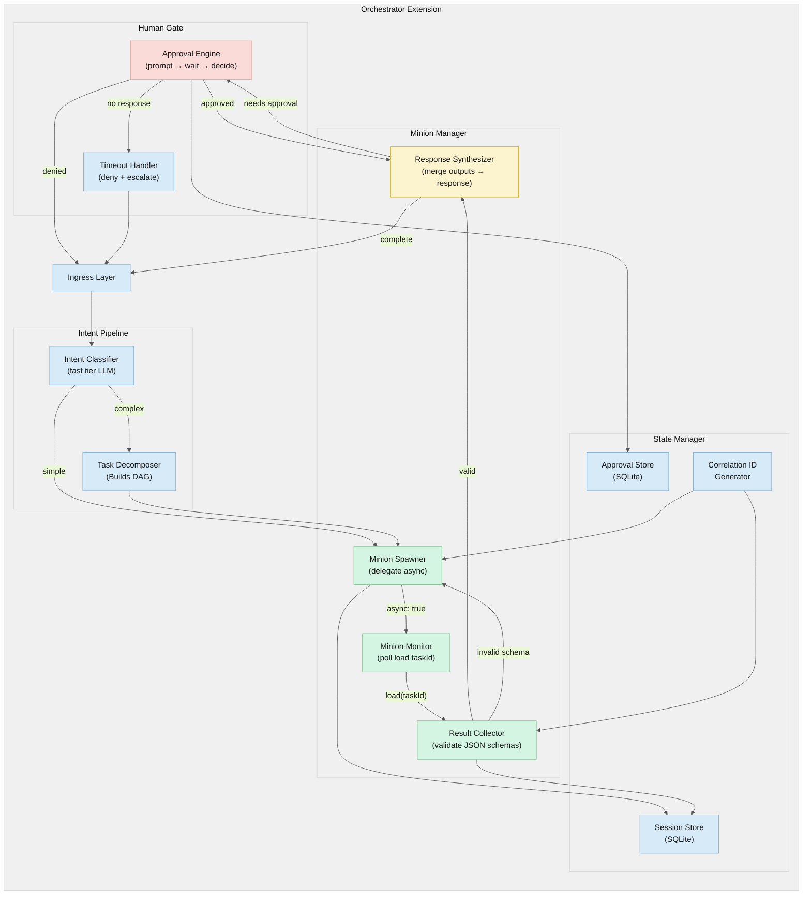

This is the **internal component diagram of the Orchestrator**. It shows how a user request is transformed into minion work and a response.

**Ingress** receives the raw message + metadata from the Slack or Teams bot adapter.

The **Intent Pipeline** classifies the request:
- **Intent Classifier** uses the `fast` tier LLM to determine the intent (`ticket_lookup`, `code_review`, `pr_create`, `ticket→fix→pr`) and whether the task is simple (sync) or complex (async). It also detects the target platform (GitHub vs. Azure DevOps) from context clues.
- **Task Decomposer** only fires for complex intents. It builds a DAG of sub-tasks: which minions can run in parallel, which depend on upstream results, and what context each needs.

The **Minion Manager** handles execution:
- **Spawner** calls `delegate(instructions, tools, async: true)`. For simple tasks it waits synchronously; for complex tasks it enqueues via Service Bus.
- **Monitor** polls `load(taskId)` on a configurable interval (default 5s). Times out the minion if it exceeds its SLA.
- **Collector** validates the minion's output against its JSON schema. Schema violations trigger a retry.
- **Synthesizer** merges multiple minion outputs into a unified platform-agnostic response object. If the response includes a destructive action, it routes to the approval engine instead of returning to the user.

The **State Manager** persists everything to SQLite: session metadata, minion run records, and pending approvals. The **Correlation ID Generator** creates the root ID (`corr_<uuid>`) and sub-IDs for each minion.

The **Human Gate** intercepts destructive actions. The Approval Engine prompts the user via Slack/Teams and waits. The Timeout Handler denies stale approvals and escalates.

---

## MCP Toolshed Internals

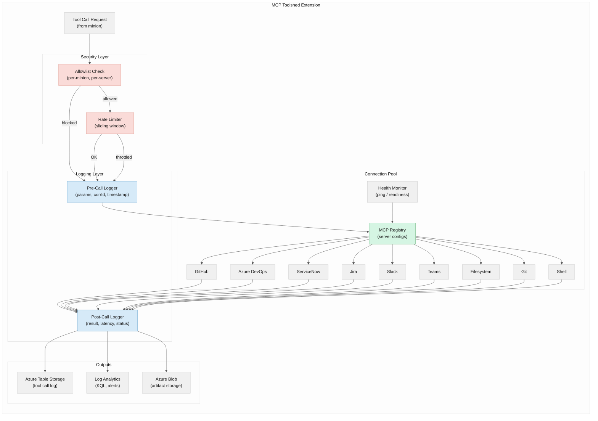

This is the **internal component diagram of the MCP Toolshed** — the most security-critical extension in the framework. Every tool call from every minion passes through here. There is no alternative path.

**Security Layer** is first. The **Allowlist Check** compares the requested tool against the calling minion's manifest (`minion_type → mcp_server → allowed_tools`). If the tool is not in the allowlist, the call is blocked and logged as a security event — it never reaches the MCP server. If allowed, the **Rate Limiter** checks a sliding window counter per server+minion pair. Throttled calls get a 429 response, and the minion is expected to back off.

**Logging Layer** captures every call twice:
- **Pre-Call Logger** records the timestamp, correlation ID, minion type, server, tool name, and parameters (truncated at 4KB) *before* the call is made.
- **Post-Call Logger** records the result summary (first 1KB), latency in milliseconds, and status (`success`, `error`, `blocked_by_allowlist`, `throttled`) *after* the call returns.

**Connection Pool** manages live connections to all MCP servers. The **MCP Registry** holds server configurations (transport type, auth, rate limits). The **Health Monitor** pings each server on a configured interval (typically 30s) and circuit-breaks unhealthy connections.

Nine MCP server connections are shown: GitHub, Azure DevOps, ServiceNow, Jira, Slack, Teams, Filesystem, Git, and Shell. Each has its own transport (SSE for remote, stdio for local) and authentication (bearer tokens, basic auth, Azure AD).

**Outputs** fan out to three destinations:
- **Table Storage** — durable, immutable audit log. Queryable by correlation ID prefix.
- **Log Analytics** — via stdout → Container Insights. Real-time KQL queries, dashboards, alerts.
- **Blob Storage** — large artifacts (full minion outputs, diffs) that don't fit in Table Storage rows.

---

## Minion Lifecycle

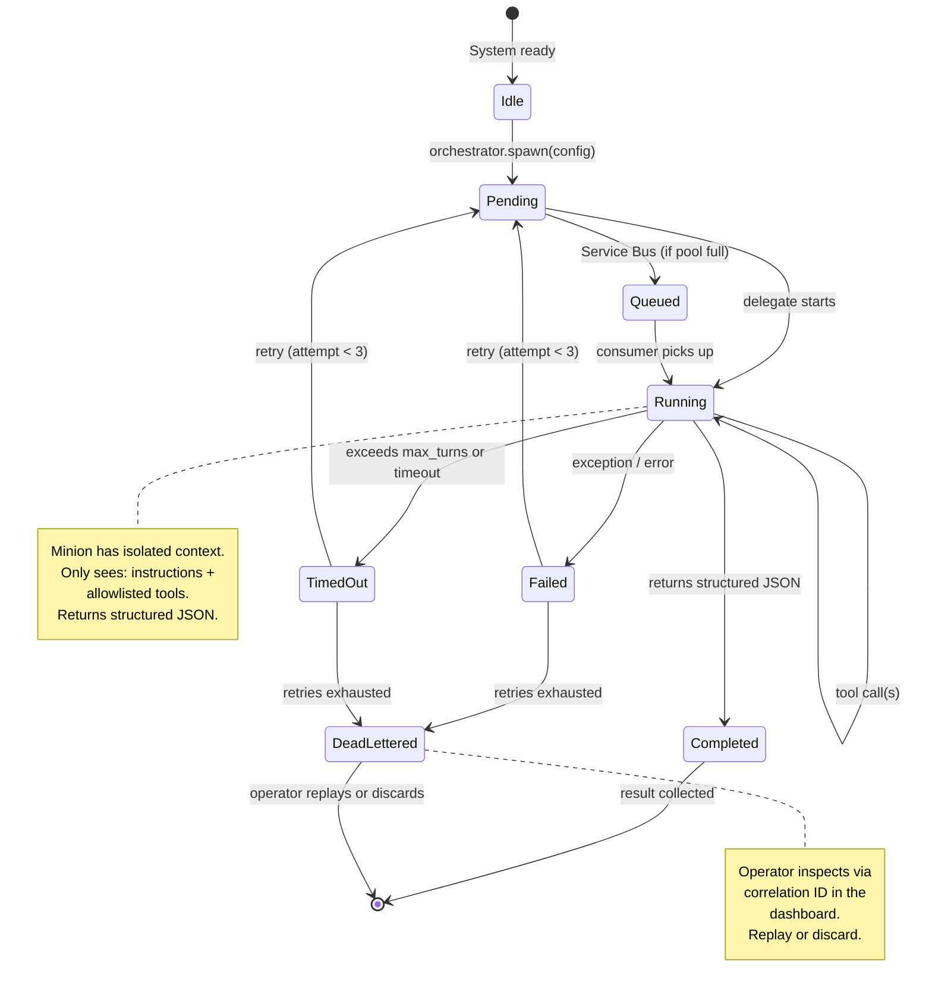

This **state diagram** shows every state a minion can be in, and the transitions between them. Minions are stateless workers — they do not persist state across invocations. The state machine is managed entirely by the orchestrator.

- **Idle → Pending**: The orchestrator calls `delegate()` with the minion's system prompt, tool allowlist, instructions, and correlation ID.
- **Pending → Running**: The delegate starts executing. If the minion pool is at capacity, the task goes to **Queued** in Service Bus instead, and a consumer picks it up when a slot opens.
- **Running**: The minion makes tool calls through the toolshed, iterates, and reasons. It has an isolated context window — it sees only its instructions and the results of tools it's allowed to call. It does not know about other minions or the orchestrator's state.
- **Completed**: The minion returns structured JSON. The orchestrator validates the schema and collects the result.
- **Failed**: An exception, error, or invalid output. The orchestrator retries up to 3 times with exponential backoff.
- **Timed Out**: The minion exceeded its configured `timeout_secs` or `max_turns`. Same retry logic applies.
- **DeadLettered**: After exhausting retries, the task moves to the Service Bus DLQ. An operator can inspect it via the dashboard (using the correlation ID) and replay or discard.

The state machine is the same for all five minion types. What differs per type is the timeout, max turns, tool allowlist, and system prompt — all defined in the orchestrator extension manifest.

---

## Sequence: Simple Query

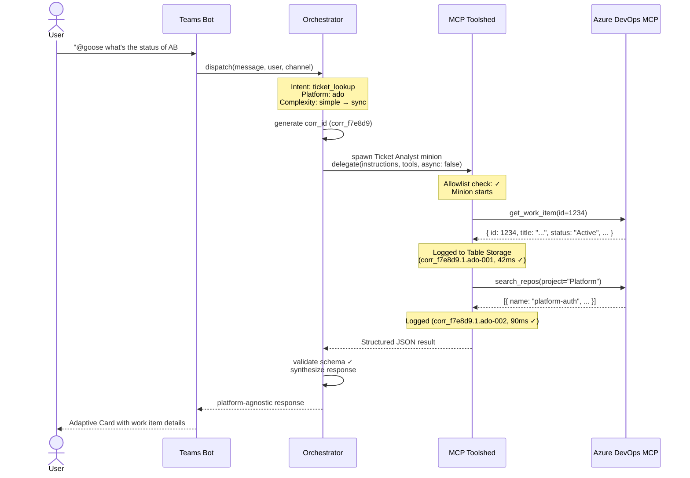

This **sequence diagram** traces a simple, synchronous query through the system. The user asks a straightforward question in Microsoft Teams: *"What's the status of work item AB#1234?"*

Key observations:

1. **The Teams Bot is a thin adapter.** It receives the message, extracts user/channel context, and forwards to the orchestrator. It does no intent classification or routing itself.

2. **The orchestrator classifies the intent as `ticket_lookup`** and determines the task is simple enough for synchronous execution (single minion, expected < 10 seconds). It generates a correlation ID (`corr_f7e8d9`) that will propagate through every subsequent call.

3. **The Ticket Analyst minion is spawned synchronously** (`async: false`). It receives a focused instruction, the correlation ID `corr_f7e8d9.1`, and its tool allowlist (ADO read + GitHub read).

4. **Two tool calls are made through the toolshed**, both logged to Table Storage: `get_work_item` to Azure DevOps (42ms) and `search_repos` to find the owning project (90ms). Each carries the full correlation ID (`corr_f7e8d9.1.ado-001`, `corr_f7e8d9.1.ado-002`).

5. **The orchestrator collects the structured JSON**, validates it against the Ticket Analyst output schema, synthesizes a platform-agnostic response, and returns it to the Teams Bot.

6. **The Teams Bot renders an Adaptive Card** with the work item title, status, assignee, and related information. The user sees the response inline in the chat.

This flow completes in under 3 seconds end-to-end.

---

## Sequence: Complex Pipeline

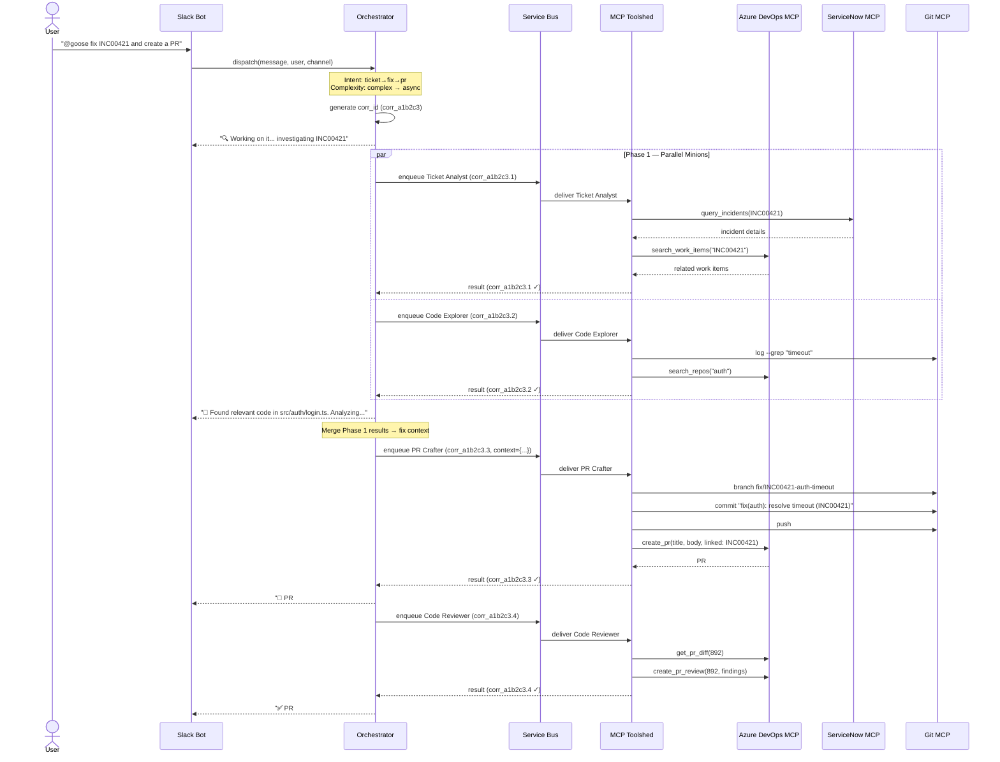

This **sequence diagram** traces the most important flow in the framework: a complex, multi-minion pipeline triggered by a single user request. The user asks in Slack: *"Fix INC00421 and create a PR."*

Key design patterns visible here:

**Async acknowledgment.** The orchestrator classifies the intent as `ticket→fix→pr` and immediately returns a "Working on it…" message to Slack. The user is not held waiting. Progress updates are posted as each phase completes.

**Parallel Phase 1.** Two minions run simultaneously via Service Bus:
- **Ticket Analyst** (`corr_a1b2c3.1`) queries ServiceNow for the incident details and cross-references Azure DevOps for related work items. This establishes *what* needs to be fixed.
- **Code Explorer** (`corr_a1b2c3.2`) searches the codebase (`git log --grep`, repo search) for files related to the incident. This establishes *where* the fix should go.

Both return structured JSON to the orchestrator. The orchestrator posts a progress update to Slack: *"Found relevant code in src/auth/login.ts."*

**Context synthesis.** The orchestrator merges the two outputs into a single fix context object: the incident description + the code locations + any related PRs. This merged context is what the PR Crafter receives — it does not need to re-query anything.

**Sequential Phase 2.** The **PR Crafter** (`corr_a1b2c3.3`) is a sequential step because it depends on both Phase 1 results. It creates a branch, implements the fix, commits, pushes, and opens a PR in Azure DevOps linked to INC00421. The orchestrator posts: *"PR #892 created. Reviewing…"*

**Quality gate.** The **Code Reviewer** (`corr_a1b2c3.4`) is another sequential step. It reviews the newly created PR and posts structured feedback. Only after this step does the orchestrator post the final summary.

**End-to-end visibility.** Every tool call in this pipeline (ServiceNow queries, git operations, PR creation, review comments) is logged with its full correlation ID. An operator can reconstruct the entire 4-minion, multi-minute pipeline from the correlation tree view in the dashboard.

---

## Sequence: Scheduled Daily PR Review

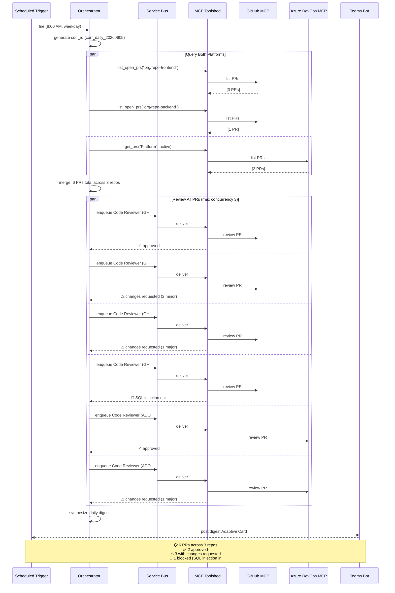

This **sequence diagram** shows a cron-triggered, fully autonomous pipeline: the daily morning PR review digest. No user initiates this — the schedule fires at 8:00 AM on weekdays.

Key design patterns:

**Platform-agnostic batching.** The orchestrator queries both GitHub and Azure DevOps simultaneously in parallel. Three queries run: open PRs in `org/repo-frontend` (GitHub), open PRs in `org/repo-backend` (GitHub), and active PRs in the "Platform" project (Azure DevOps). Results are merged: 6 PRs across 3 repos.

**Max concurrency control.** Six Code Reviewer minions are spawned, but only 3 run concurrently (configured in `governance.yaml`). The orchestrator enqueues all 6 via Service Bus; the container scaling rules ensure no more than 3 are processed at once. This prevents GitHub/ADO rate limit exhaustion from 6 simultaneous diff fetches.

**Independent review per PR.** Each minion reviews exactly one PR. It fetches the diff, analyzes for issues (correctness, performance, security, style), and posts structured review comments. Each minion's output is a standard Code Reviewer JSON schema: `{ findings: [...], summary, approved }`.

**Synthesized digest.** The orchestrator collects all 6 outputs and produces a single Adaptive Card digest for Teams:
- 2 approved
- 3 with changes requested (2 major, 1 minor)
- 1 blocked (SQL injection risk in PR #570)

**Autonomous but not destructive.** The digest is posted for information. The "Approve Passing" button on the Adaptive Card requires explicit human interaction. The Code Reviewer never merges autonomously (ADR-007).

This flow demonstrates the framework running unattended on a schedule, delivering value before the team starts their day.

---

## Data Model

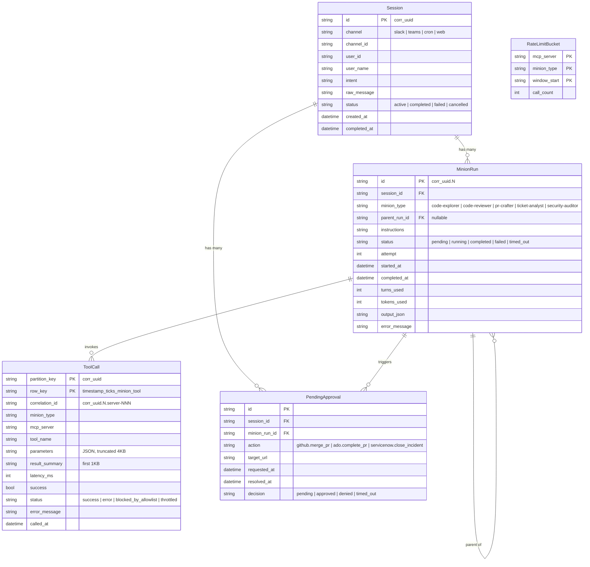

This **entity-relationship diagram** shows the data model that underpins the framework. It spans two physical stores: SQLite (session state) and Azure Table Storage (tool call log).

**Session** is the root entity. One session = one user interaction (a Slack message, a Teams message, a cron trigger). It records who asked, from which platform, what the intent was, and the raw message. Status tracks whether the session is active, completed, or failed.

**MinionRun** is a child of Session. One session can spawn many minions (the `1..*` relationship). Each run records: which minion type was dispatched, the instructions it received, how many turns and tokens it consumed, and whether it completed, failed, or timed out. The `parent_run_id` self-reference enables the DAG structure — a PR Crafter run can reference its upstream Ticket Analyst run as its parent.

**ToolCall** is a child of MinionRun. Stored in Azure Table Storage (not SQLite) because it's append-only and benefits from Table Storage's cost model. The compound key uses `corr_uuid` as the partition key and `timestamp_ticks_minion_tool` as the row key. This design enables prefix queries: "give me every tool call for session `corr_a1b2c3`" is a single partition scan.

**PendingApproval** tracks destructive actions awaiting human confirmation. It references both the session and the specific minion run that requested the action. The decision field records the outcome: approved, denied, or timed out.

**RateLimitBucket** is ephemeral — a sliding window counter for the rate limiter in the toolshed. Keyed by MCP server + minion type + time window start. When the window expires, the bucket is reset. This table can live purely in-memory with occasional flush to SQLite.

The foreign key relationships show the traceability chain: Session → MinionRun → ToolCall. Given a session correlation ID, you can reconstruct every minion that ran and every tool it called.

---

## Observability Data Flow

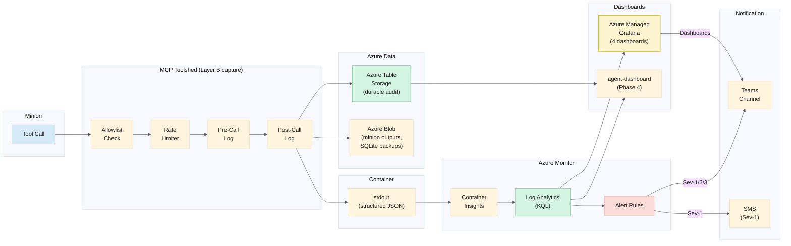

This **data flow diagram** traces the journey of a single tool call from the minion to every dashboard and alert channel. It illustrates the three-layer capture model (ADR-016) and the two-tier observability approach (ADR-018).

**Layer B is the primary capture point.** Every tool call hits the MCP Toolshed, which runs the allowlist check, rate limiter, pre-call log, and post-call log in sequence. The post-call log fans out to three destinations:

1. **Azure Table Storage** — the durable, immutable audit log. Partitioned by correlation ID. Queried by the custom `agent-dashboard` (Phase 4) for session reconstruction and correlation tree views.

2. **stdout (structured JSON)** — picked up by Container Insights and forwarded to Log Analytics. This is the real-time path.

3. **Azure Blob Storage** — for large artifacts that exceed Table Storage's row size or Log Analytics' ingestion limits. Full minion outputs and complete diffs live here.

**Log Analytics** is the KQL engine. It serves two consumers:
- **Azure Managed Grafana** queries it for the four operational dashboards (Overview, Minion Health, Cost & Capacity, Security). These dashboards are the primary operational interface.
- **Alert Rules** evaluate KQL queries on a schedule. Sev-1 alerts (tool call failure rate > 20%) go to both Teams and SMS. Sev-2 alerts (timeout rate, DLQ depth) go to Teams. Sev-3 alerts (rate limit hits, idle detection) go to Teams as informational messages.

**The custom `agent-dashboard`** (Phase 4) reads from both Table Storage and Log Analytics. It provides Goose-specific views that Grafana cannot: session replay, correlation tree visualization, and governance configuration.

The design ensures that no single storage failure loses observability: Table Storage handles durability, Log Analytics handles real-time querying, and Blob handles large payloads.

---

## Azure Deployment Topology

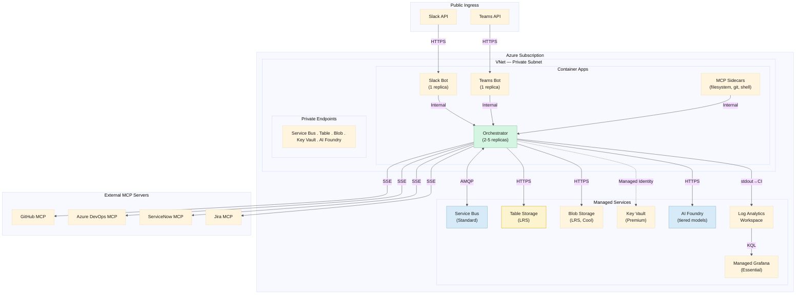

This **deployment diagram** maps every logical component to its Azure resource. It shows what runs where, what talks to what, and — critically — what crosses the VNet boundary.

**Inside the VNet (private subnet):**
- **Container Apps** host the four Goose extensions: Orchestrator (2-5 replicas, autoscaled by KEDA on Service Bus queue depth), Slack Bot (1 replica), Teams Bot (1 replica), and MCP Sidecars (filesystem, git, shell — stdio-based MCP servers that must colocate with the orchestrator).
- **Private Endpoints** connect Container Apps to Azure managed services without traversing the public internet. Service Bus, Table Storage, Blob Storage, Key Vault, and AI Foundry are all reached via private IP. This is the default Azure landing-zone pattern.

**Outside the VNet:**
- **Managed services** are provisioned but accessed through private endpoints. They are in the same Azure subscription but logically outside the VNet boundary in Mermaid's notation.
- **Public ingress** is limited to Slack API and Teams API. These are the only public-facing endpoints. The bots listen for inbound webhooks.
- **External MCP servers** (GitHub, Azure DevOps, ServiceNow, Jira) are reached via SSE over HTTPS. They run in third-party clouds or on-premises.

**Managed Identity** is the authentication backbone. The orchestrator authenticates to Key Vault, Service Bus, Storage, and AI Foundry using its Azure Container Apps managed identity — no static keys in environment variables or config files. MCP server credentials (GitHub PAT, ADO PAT, ServiceNow credentials) are fetched from Key Vault at startup and held in memory only.

**The `.->` (dotted) arrow** to Key Vault indicates that this connection is indirect: the Azure SDK handles token acquisition via managed identity. The application code never sees a secret.

---

## Security Boundaries

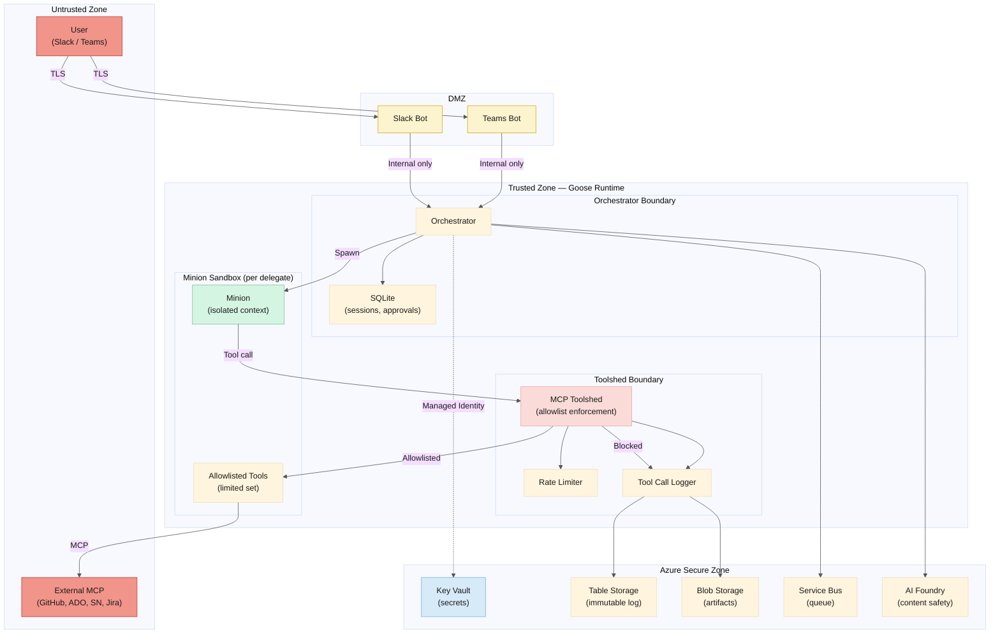

This is the **trust-boundary diagram**. It defines four zones with increasing levels of trust, and the rules that govern transitions between them.

**Untrusted Zone (🔴 red):** Everything outside our control. The user's Slack/Teams client and all external MCP servers (GitHub, Azure DevOps, ServiceNow, Jira). Data from this zone is treated as hostile — it may contain prompt injection, malformed payloads, or unexpected content. All connections from this zone are over **TLS**. External MCP responses are validated before they reach minions.

**DMZ (🟡 yellow):** The Slack Bot and Teams Bot. These are the only components that accept inbound connections from the internet. They validate platform signatures (Slack signing secret, Teams Bot Framework authentication), extract the message payload, and forward it to the orchestrator over **internal-only** connections. The bots do not hold credentials to any external system beyond what they need to send/receive messages.

**Trusted Zone — Goose Runtime (🟢 green):** The orchestrator, minions, and toolshed. This zone has no direct internet exposure. It communicates outbound to Azure services and external MCP servers, but never accepts unsolicited inbound connections.
- **Minion Sandbox:** Each minion is a Goose delegate with an isolated context window. It sees only the tools it's been allowlisted for. It cannot access the orchestrator's memory, other minions' state, or unapproved tools.
- **Toolshed Boundary:** The toolshed is the mandatory gate between minions and external MCP servers. Every call passes through allowlist enforcement and rate limiting. Blocked calls are logged as security events — they never reach the target server.

**Azure Secure Zone (🔵 blue):** Azure managed services accessed via managed identity. No static credentials exist in application code or environment variables. Key Vault is the secrets store. Table Storage is the immutable audit log (append-only). AI Foundry provides content safety filtering at the platform level.

The critical security property of this architecture: **an external MCP server can never call back into Goose**. All connections are outbound. A compromised MCP server cannot reach the orchestrator, cannot access other MCP server credentials, and cannot tamper with the audit log.

---

| Color | Hex | Meaning |
|---|---|---|
| 🟢 Light green | `#d5f5e3` | Goose runtime components (orchestrator, minions, MCP registry) |
| 🔵 Light blue | `#d6eaf8` | Infrastructure / processing (classifiers, loggers, Service Bus, AI Foundry) |
| 🟡 Pale yellow | `#fcf3cf` | Boundary / synthesis / intermediary (synthesizer, bots, Table Storage) |
| 🔴 Pale red | `#fadbd8` | Security / blocking / alerts (allowlist, rate limiter, approval flow) |
| 🔶 Warm red | `#f1948a` | Untrusted zone (user input, external MCP) |

All diagrams use **dark text** (`#1a1a1a`) on light backgrounds for readability. Theme is `base` with explicit `color` directives.

---

## References

- [High-Level Design](./high-level-design.md) — full architecture narrative
- [ADRs](./adrs.md) — all architecture decision records (ADR-001 through ADR-018)
- [ADR-018: Observability Dashboard](./adrs/adr-018-observability-dashboard.md) — observability design
